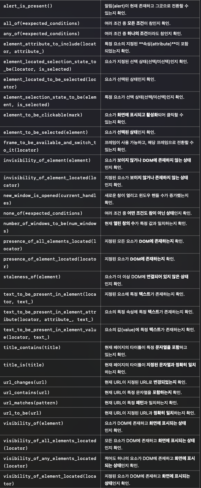

# 참고 자료

+ [Selenium 공식 레퍼런스 문서의 Expected Conditions](https://www.selenium.dev/selenium/docs/api/py/webdriver_support/selenium.webdriver.support.expected_conditions.html#module-selenium.webdriver.support.expected_conditions)에서 모든 wait 조건을 확인하실 수 있습니다. 



+ 자주 사용하는 조건을 몇 개 소개하자면 아래와 같습니다.


    + element_to_be_clickable(): 웹 요소가 클릭 가능한 상태일 때까지 기다림.

    + visibility_of_element_located(): 웹 요소가 실제로 보일 때까지 기다림.

    + text_to_be_present_in_element(): 웹 요소 안에 텍스트가 로딩될 때까지 기다림.

    + invisibility_of_element_located(): 웹 요소가 안 보일 때까지 기다림.

+ `explicit wait`은 코드가 훨씬 복잡한 대신 더 정확한 wait 조건을 사용할 수 있습니다. 

+ 이걸 활용하면 무조건 정해진 기간을 기다리는 sleep()을 쓰는 것보다 더 효율적인 코드를 짤 수 있겠죠? 

+ 웹 요소에 알맞은 조건을 잘 사용하면 로딩 문제 때문에 코드가 실패할 확률도 낮아집니다. 

+ 많은 동작이 실패 없이 연속적으로 이루어져야 할 때는 explicit wait을 활용해 보세요!

---

# 액션 체인이란?

+ Selenium에서 액션 체인(action chain)은 사용자의 마우스, 키보드 동작(action)을 사슬(chain)처럼 이어서 실행하는 것을 말해요. 

+ 액션 체인을 사용하면 우리가 배운 클릭, 키보드 입력뿐만이 아니라 더블 클릭, 드래그 등 사용자의 모든 마우스, 키보드 동작을 자동화할 수 있는데요. 

+ 특히 클릭, 키보드 입력 말고 다른 동작은 액션 체인이 꼭 필요합니다. 

+ 그리고 많은 동작을 한 번에 묶어서 실행할 수 있습니다. 

+ 사용자 동작 시나리오가 복잡해질 때 유용합니다.

## 액션 체인 사용하기

+ 액션 체인을 사용하는 방법에는 두 가지가 있습니다.

    1. 한 줄의 코드에서, 꼬리에 꼬리를 무는 방식으로 연결하는 방식

    2. 하나의 액션을 한 줄로 만들어서, 나열하는 방식

+ 두 방법 모두, 하나의 동작이 완료되면 그다음 동작이 순서대로 실행됩니다.

## 연결하는 방식
```python
from selenium.webdriver.common.action_chains import ActionChains

# 사용자 동작에 필요한 웹 요소들 찾기

(ActionChains(driver)
    # 사용자 액션 정의 
    .perform())
```

## 나열하는 방식
```python
from selenium.webdriver.common.action_chains import ActionChains

# 사용자 동작에 필요한 웹 요소들 찾기

actions = ActionChains(driver)

# 사용자 액션 정의

actions.perform()
```

## 액션 체인 예시

+ `# 사용자 액션 정의`부분에는 액션을 수행하는 메소드들을 쭉 써 주면 됩니다. 

+ 액션 메소드들은 마지막 섹션에 정리돼 있습니다. 예를 들어서 코스타그램(https://workey.codeit.kr/costagram) 사이트의 로그인 동작을 액션 체인으로 구현해 볼게요.

## 연결하는 방식

```python
from time import sleep

from selenium import webdriver
from selenium.webdriver import ActionChains
from selenium.webdriver.common.by import By

driver = webdriver.Chrome()
driver.implicitly_wait(3)

driver.get('https://workey.codeit.kr/costagram/index')

# 로그인 링크 클릭
driver.find_element(by=By.CSS_SELECTOR, value='.top-nav__login-link').click()
sleep(1)

# 아이디 박스, 비밀번호 박스, 로그인 버튼 찾아 놓기
id_box = driver.find_element(by=By.CSS_SELECTOR, value='.login-container__login-input')
pw_box = driver.find_element(by=By.CSS_SELECTOR, value='.login-container__password-input')
login_button = driver.find_element(by=By.CSS_SELECTOR, value='.login-container__login-button')

# 액션 실행
(ActionChains(driver)
 .send_keys_to_element(id_box, 'codeit')
 .send_keys_to_element(pw_box, 'datascience')
 .click(login_button)
 .perform())

driver.quit()
```

+ 액션 실행 부분에서는 ActionChains를 만들어 주고, 필요한 동작을 모두 정의해 주고, 끝에 `.perform()` 메소드를 호출해 줍니다. 

+ 코드를 다 한 줄에 써도 되지만, 그러면 한 줄이 너무 길어지기 때문에 괄호 ()로 코드를 감싸 줬습니다.

+ 액션 체인을 사용할 때는 액션 체인에 필요한 웹 요소들을 먼저 다 찾아 놔야 합니다. 

+ 그런데 로그인 과정을 생각해 보면, 로그인 링크를 클릭해야 로그인 창이 뜨죠?

+ 로그인 링크를 클릭한 다음에만 아이디 입력 박스 같은 요소들을 찾을 수 있습니다. 

+ 로그인 링크를 클릭하기 전에는 필요한 요소들을 다 찾아 놓을 수 없는 거죠.

+ 따라서 처음에 **로그인 링크를 클릭하는 것은 체인으로 연결할 수 없고**, **나머지 아이디 입력, 비밀번호 입력, 로그인 버튼 클릭만 연결할 수 있습니다.**

+ 아래 코드는 오류가 납니다. 로그인 링크를 클릭하기 전에 아이디 입력 박스를 찾으려고 하기 때문이죠.

```python
from time import sleep

from selenium import webdriver
from selenium.webdriver import ActionChains
from selenium.webdriver.common.by import By

driver = webdriver.Chrome()
driver.implicitly_wait(3)

driver.get('https://workey.codeit.kr/costagram/index')

# 로그인 링크, 아이디 박스, 비밀번호 박스, 로그인 버튼 찾아 놓기
login_link = driver.find_element(by=By.CSS_SELECTOR, value='.top-nav__login-link')
id_box = driver.find_element(by=By.CSS_SELECTOR, value='.login-container__login-input')
pw_box = driver.find_element(by=By.CSS_SELECTOR, value='.login-container__password-input')
login_button = driver.find_element(by=By.CSS_SELECTOR, value='.login-container__login-button')

# 액션 실행
(ActionChains(driver)
    .click(login_link)
    .send_keys_to_element(id_box, 'codeit')
    .send_keys_to_element(pw_box, 'datascience')
    .click(login_button)
    .perform())

driver.quit()
```

## 나열하는 방식

```python
from time import sleep

from selenium import webdriver
from selenium.webdriver import ActionChains
from selenium.webdriver.common.by import By

driver = webdriver.Chrome()
driver.implicitly_wait(3)

driver.get('https://workey.codeit.kr/costagram/index')

# 로그인 링크 클릭
driver.find_element(by=By.CSS_SELECTOR, value='.top-nav__login-link').click()
sleep(1)

# 아이디 박스, 비밀번호 박스, 로그인 버튼 찾아 놓기
id_box = driver.find_element(by=By.CSS_SELECTOR, value='.login-container__login-input')
pw_box = driver.find_element(by=By.CSS_SELECTOR, value='.login-container__password-input')
login_button = driver.find_element(by=By.CSS_SELECTOR, value='.login-container__login-button')

# 액션 실행
actions = ActionChains(driver)
actions.send_keys_to_element(id_box, 'codeit')
actions.send_keys_to_element(pw_box, 'datascience')
actions.click(login_button)
actions.perform()

driver.quit()
```

+ 나열하는 방식은 한 줄에 하나의 액션을 써 줍니다. 연결하는 방식과 나열하는 방식 중 편하신 방법을 사용하시면 됩니다.

## 액션 체인 기능

+ 액션 체인으로 구현할 수 있는 기능을 몇 개 정리해 드릴게요. 

+ 함수에 parameter=None은 파라미터가 **선택적**이라는 뜻입니다. 

+ 나머지 파라미터는 필수입니다. 

+ 나머지 사용자 동작이 궁금하시다면 [Selenium 공식 레퍼런스 문서의 Action Chains](https://www.selenium.dev/selenium/docs/api/py/webdriver/selenium.webdriver.common.action_chains.html)에서 확인해 보세요.

### 클릭
```python
.click(element=None)
```

+ 웹 요소 element를 파라미터로 전달해 주면 element를 클릭하고 그렇지 않으면 현재 마우스가 위치해 있는 곳을 클릭합니다.

### 오른쪽 클릭
```python
.context_click(element=None)
```

+ 웹 요소 element를 파라미터로 전달해 주면 element를 오른쪽 클릭하고 그렇지 않으면 현재 마우스가 위치해 있는 곳을 오른쪽 클릭합니다.

### 더블 클릭
```python
.double_click(element=None)
```

+ 웹 요소 element를 파라미터로 전달해 주면 element를 더블 클릭하고 그렇지 않으면 현재 마우스가 위치해 있는 곳을 더블 클릭합니다.

### 드래그 앤 드롭
```python
.drag_and_drop(source, target)
```

+ source 웹 요소를 클릭해서 target 웹 요소까지 드래그한 다음, 드롭해 줍니다.

### 마우스 이동
```python
.move_to_element(element)
```

+ element 웹 요소까지 마우스를 움직입니다.

### 키보드 입력
```python
.send_keys(keys)
.send_keys_to_element(element, keys)
```

+ `send_keys()`는 현재 선택된 웹 요소에 키보드 입력을 보내고, 

+ `send_keys_to_element()`는 element 요소에 키보드 입력을 보냅니다.

### 동작 중지
```python
.pause(seconds)
```

+ seconds초 동안 동작을 멈춥니다. 액션 체인에는 sleep() 대신 `.pause()`를 써 주세요.