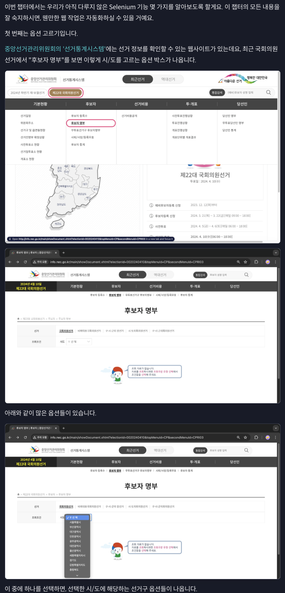
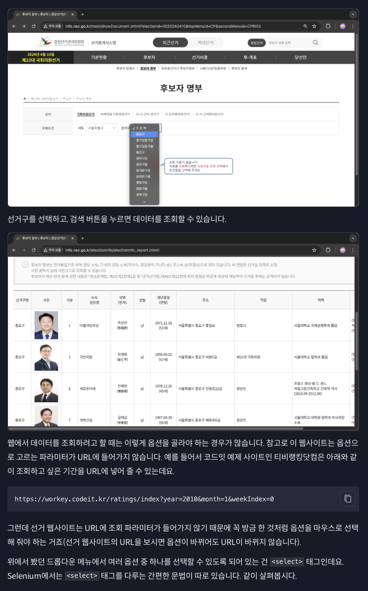
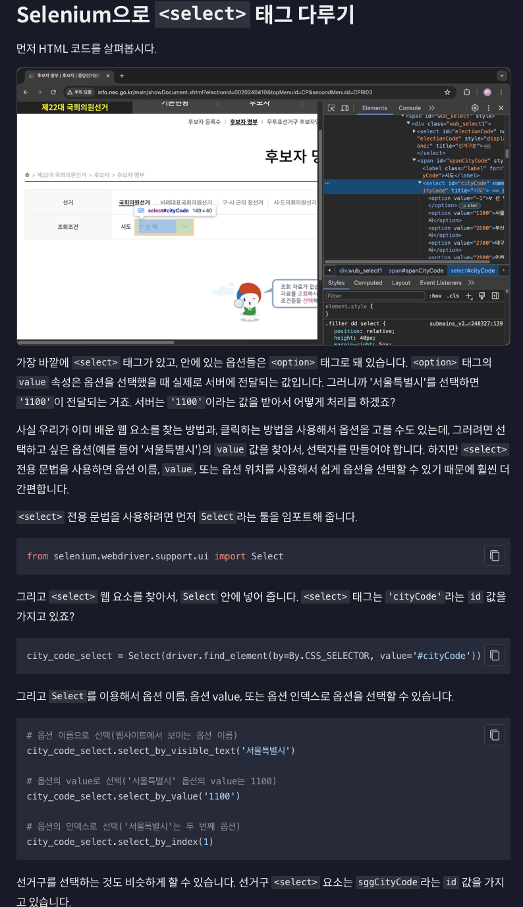
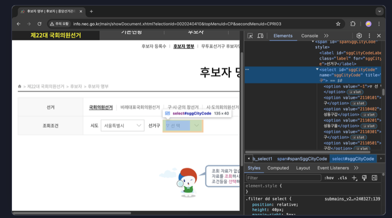

```python
sgg_city_code_select = Select(driver.find_element(by=By.CSS_SELECTOR, value='#sggCityCode'))

# 옵션 이름으로 선택(웹사이트에서 보이는 옵션 이름)
sgg_city_code_select.select_by_visible_text('종로구')

# 옵션의 value로 선택('종로구' 옵션의 value는 2110101)
sgg_city_code_select.select_by_value('2110101')

# 옵션의 인덱스로 선택('종로구'는 두 번째 옵션)
sgg_city_code_select.select_by_index(1)
```

+ 서울특별시와 종로구를 선택하고, 필요한 국회의원 정보를 가져오는 코드를 짜 보면 아래와 같겠죠?

```python
from time import sleep

from selenium import webdriver
from selenium.webdriver.common.by import By
from selenium.webdriver.support.ui import Select

driver = webdriver.Chrome()
driver.implicitly_wait(3)

# 선거 웹사이트 접속
driver.get('http://info.nec.go.kr/main/showDocument.xhtml?electionId=0020240410&topMenuId=CP&secondMenuId=CPRI03')
sleep(1)

# '국회의원선거'탭 클릭 
driver.find_element(by=By.CSS_SELECTOR, value='#electionId2').click()

# 서울특별시 선택
city_code_select = Select(driver.find_element(by=By.CSS_SELECTOR, value='#cityCode'))
city_code_select.select_by_visible_text('서울특별시')

# 종로구 선택
sgg_city_code_select = Select(driver.find_element(by=By.CSS_SELECTOR, value='#sggCityCode'))
sgg_city_code_select.select_by_visible_text('종로구') 

# '검색'버튼 클릭
driver.find_element(by=By.CSS_SELECTOR, value='#spanSubmit').click()

# 필요한 국회의원 정보 가져오기

# 웹 드라이버 종료
driver.quit()
```