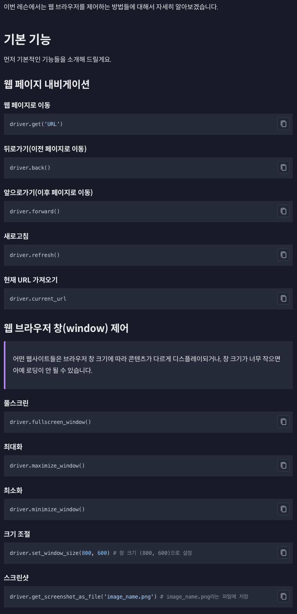
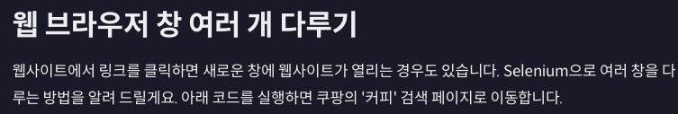
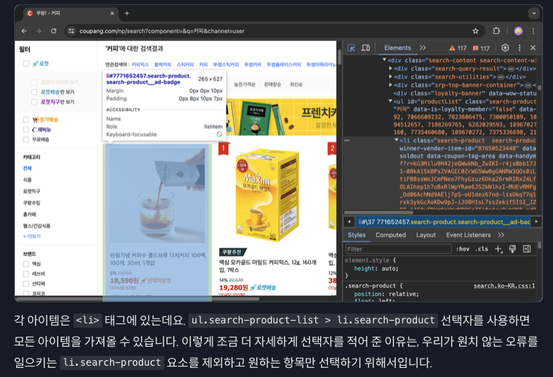
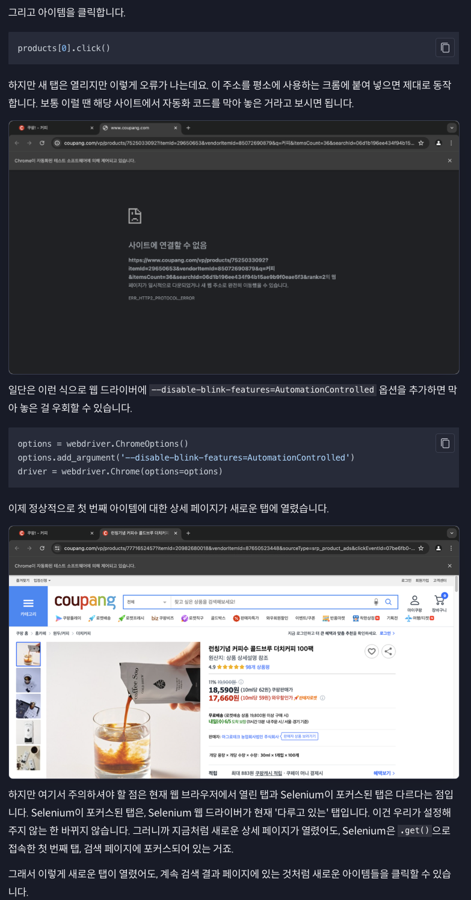
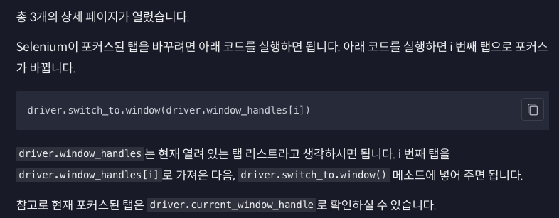
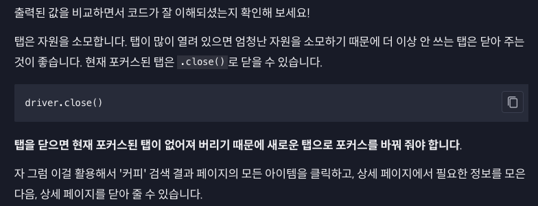

```python
from time import sleep

from selenium import webdriver

driver = webdriver.Chrome()
driver.implicitly_wait(3)

# 쿠팡 '커피' 검색 결과 페이지 접속
driver.get('https://www.coupang.com/np/search?component=&q=%EC%BB%A4%ED%94%BC&channel=user')
sleep(1)
```



```python
products = driver.find_elements(by=By.CSS_SELECTOR, value='ul.search-product-list > li.search-product')
```



```python
from time import sleep

from selenium import webdriver
from selenium.webdriver.common.by import By

options = webdriver.ChromeOptions()
options.add_argument('--disable-blink-features=AutomationControlled')
driver = webdriver.Chrome(options=options)
driver.implicitly_wait(3)

# 쿠팡 '커피' 검색 결과 페이지 접속
driver.get('https://www.coupang.com/np/search?component=&q=%EC%BB%A4%ED%94%BC&channel=user')
sleep(1)

products = driver.find_elements(by=By.CSS_SELECTOR, value='ul.search-product-list > li.search-product')

products[0].click()
products[1].click()
products[2].click()

sleep(5)
driver.quit()
```



```python
from time import sleep

from selenium import webdriver
from selenium.webdriver.common.by import By

options = webdriver.ChromeOptions()
options.add_argument('--disable-blink-features=AutomationControlled')
driver = webdriver.Chrome(options=options)
driver.implicitly_wait(3)

# 쿠팡 '커피' 검색 결과 페이지 접속
driver.get('https://www.coupang.com/np/search?component=&q=%EC%BB%A4%ED%94%BC&channel=user')
sleep(1)

products = driver.find_elements(by=By.CSS_SELECTOR, value='ul.search-product-list > li.search-product')

products[0].click()
products[1].click()
products[2].click()

# 모든 탭 리스트
print(driver.window_handles)

# 현재 포커스된 탭 - 아직 탭을 바꿔 주지 않았기 때문에 처음 .get()으로 접속한 탭
print(driver.current_window_handle)

# 두 번째 탭으로 바꿔 주기
driver.switch_to.window(driver.window_handles[1])

# 현재 포커스된 탭
print(driver.current_window_handle)

sleep(5)
driver.quit()
```

```python
['ACB1A94FF1FDC6F5C35E66FE6771487C', 'B36B6872F44793173531C562A49C646A', '58ECAF2A1E8C3C3473D797DA20AA2298', '10BD8D0116EAD3F6A71551B69BFCD008']
ACB1A94FF1FDC6F5C35E66FE6771487C
B36B6872F44793173531C562A49C646A
```



```python
from time import sleep

from selenium import webdriver
from selenium.webdriver.common.by import By

options = webdriver.ChromeOptions()
options.add_argument('--disable-blink-features=AutomationControlled')
driver = webdriver.Chrome(options=options)
driver.implicitly_wait(3)

# 쿠팡 '커피' 검색 결과 페이지 접속
driver.get('https://www.coupang.com/np/search?component=&q=%EC%BB%A4%ED%94%BC&channel=user')
sleep(1)

products = driver.find_elements(by=By.CSS_SELECTOR, value='ul.search-product-list > li.search-product')

# 검색 결과 페이지로 계속 돌아올 것이기 때문에 저장해 놓기
search_result_window = driver.current_window_handle

for product in products:
    # 아이템 클릭
    product.click()
    sleep(1)

    # 아이템 상세 페이지로 포커스 이동
    driver.switch_to.window(driver.window_handles[1])

    # 아이템 상세 페이지에서 필요한 정보 가져오기

    # 아이템 상세 페이지 닫기
    driver.close()

    # 검색 결과 페이지로 포커스 이동 - 그래야 아이템 (product)를 클릭할 수 있음
    driver.switch_to.window(search_result_window)

sleep(5)
driver.quit()
```

+ `driver.switch_to.window()`, `driver.window_handles` 이 두 가지를 활용하면 여러 탭을 자유롭게 다룰 수 있습니다.