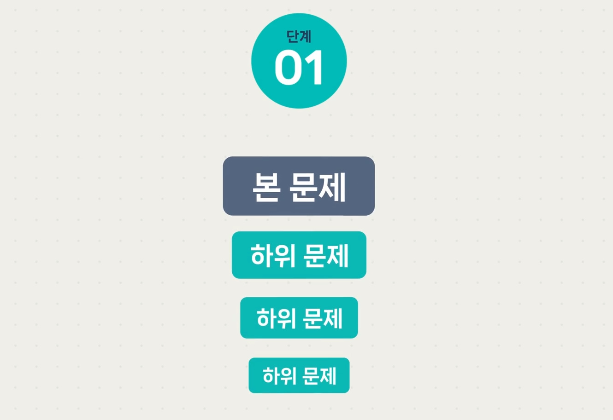
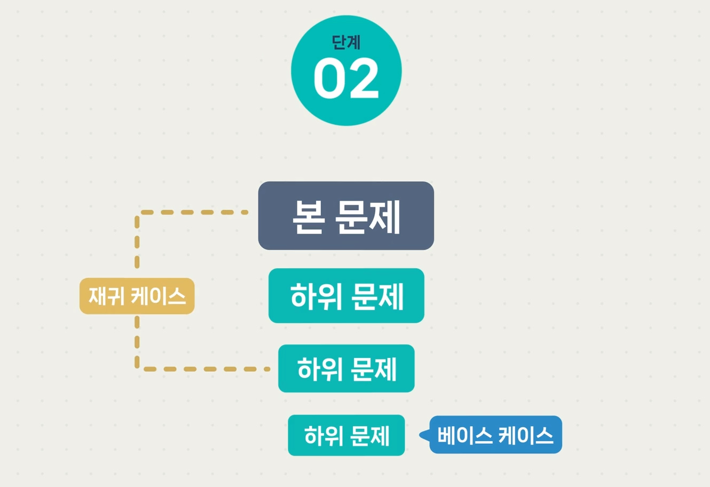
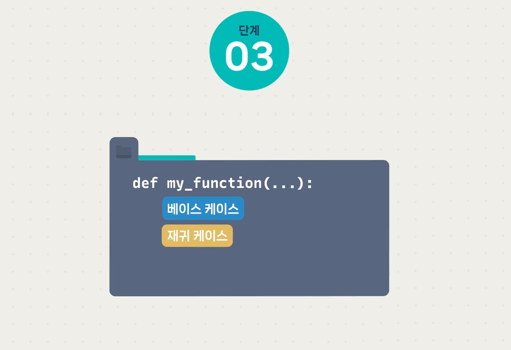
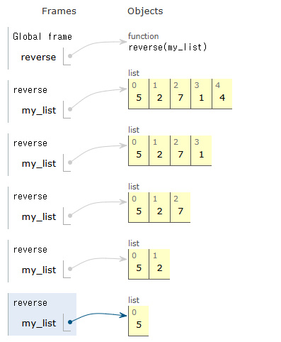
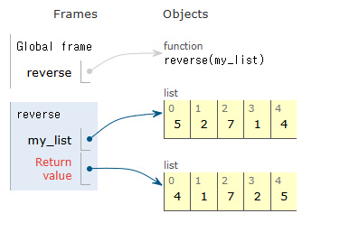

# 재귀 함수를 구현하는 3가지 방법
### 1. 하위 문제를 찾는다 
+ 하위 문제를 찾을 때는 파라미터로 받은 인풋의 사이즈를 하나 줄이면 어떻게 될 까?를 생각해 본다.
### 2. 베이스 케이스와 재귀 케이스를 정한다 

+ 베이스 케이스(Base Case)
    + 하위 문제 없이 바로 답을 찾을 수 있는 경우

+ 재귀 케이스(Recursive Case)
    + 하위 문제가 존재하는 경우
### 3. 마지막으로 두 단계에서 정리한 내용을 토대로 함수를 구현한다. 

```python
# 리스트를 뒤집는 함수
def reverse(my_list):
    # Base Case
    if len(my_list) <= 1:
        """
        만약 리스트의 길이가 1 이하(리스트에 요소가 없거나 하나뿐인 경우)라면, 
        그대로 반환한다.
        """   
        return my_list
    # Recursive Case
    return my_list[-1:] + reverse(my_list[:-1])
    """
    1. my_list[-1:]는 리스트의 마지막 요소를 슬라이싱하여 리스트 형태로 가져온다. (예: [4])
    2. reverse(my_list[:-1])는 my_list의 마지막 요소를 제외한 나머지를 재귀적으로 뒤집는다.
    3. 마지막 요소([4])와 재귀 호출의 결과를 결합하여 새로운 리스트를 반환한다.
    """

print(reverse([5, 2 , 7, 1, 4]))
"""리스트 [5, 2, 7, 1, 4]를 reverse 함수로 뒤집고 결과를 출력한다."""
```

 