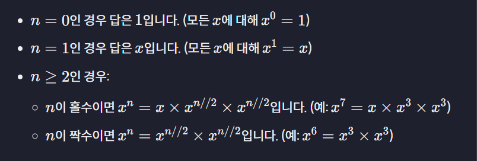
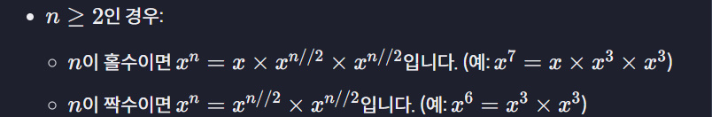

# 해설

+ 우리가 재귀로 구현하려는 알고리즘은 아래와 같습니다.



+ 함수가 두 개의 파라미터 `x와 n`을 받기 때문에 좀 더 어렵게 느껴질 수 있는데요. 

+ `x`는 변하지 않기 때문에 **상수**처럼 취급할 수 있습니다. 

+ **즉, 재귀 케이스에 대해 생각할 때 `x`는 신경 쓰지 않고 `n`이 어떻게 되는지만 생각하면 됩니다.**

+ 그렇다면 `n`이 어떤 값일 때 바로 답을 구할 수 있을까요? 

+ `n`이 0이나 1인 경우 답을 바로 구할 수 있고 `(베이스 케이스)`, 

+ `n`이 2보다 크거나 같다면 하위 문제로 나눠야 합니다 `(재귀 케이스)`.

```python
def power(x, n):
    # 베이스 케이스
    if n == 0:
        return 1

    if n == 1:
        return x

    # 재귀 케이스
```

+ 두 가지 `베이스 케이스`가 **서로 다른 결괏값을 리턴**하므로 각각 따로 작성해야 합니다.

+ 그럼 이제 `재귀 케이스`의 알고리즘은 코드로 바꿔봅시다.



```python
def power(x, n):
    # 베이스 케이스
    if n == 0:
        return 1

    if n == 1:
        return x

    # 재귀 케이스
    if n % 2 == 0:
        return power(x, n // 2) * power(x, n // 2)
    else:
        return x * power(x, n // 2) * power(x, n // 2)
```

+ `n`이 **짝수인 경우, 홀수인 경우**를 처리해 주고 

+ `$x^{n//2}$`를 재귀 함수 `$power(x, n // 2)$`로 바꿔줬습니다. 

+ 그리고 마지막 `else문`은 삭제할 수도 있지만, 이 경우 `else문`을 유지해서 `n`이 홀수/짝수인 경우로 나누는 것을 명확하게 보여줄 수 있습니다.

+ 자 이렇게 써도 작동은 하지만, 지금은 `$power(x, n // 2)$`을 두 번씩 호출합니다. 

+ `$power(x, n // 2)$`를 계산하는 과정을 두 번 반복하기 때문에 코드에 비효율이 발생하는데요. 

+ 대신 `$power(x, n // 2)$`의 값을 변수에 저장해 두면 여러 번 계산하지 않아도 됩니다. 

+ 아래 코드에서는 `temp`라는 변수에 저장했습니다.

```python
def power(x, n):
    # 베이스 케이스
    if n == 0:
        return 1

    if n == 1:
        return x

    # 재귀 케이스
    temp = power(x, n // 2)
    if n % 2 == 0:
        return temp * temp
    else:
        return x * temp * temp
```

+ 이제 `$power(x, n // 2)$`를 한 번만 계산하기 때문에 더 효율적인 코드가 된 거죠.

# 모범 답안

```python
def power(x, n):
    # 베이스 케이스
    if n == 0:
        return 1

    if n == 1:
        return x
   
    # 재귀 케이스
    temp = power(x, n // 2)
    if n % 2 == 0:
        return temp * temp
    else:
        return x * temp * temp


# 테스트 코드
print(power(2, 3))
print(power(5, 0))
print(power(17, 5))
print(power(3, 17))
print(power(4, 18))
```