# 평균

+ 먼저 **평균을 구하는 방법**을 잠깐 살펴볼게요. 

+ 이번 주 화요일 날 눈이 1cm 쌓였고, 수요일 날 눈이 2cm 쌓였고, 목요일 날은 많이 와서 5cm 쌓였다면 3일 동안의 평균 적설량은 어떻게 구할까요? 

+ 3일 동안 쌓였던 양을 전부 더하고, 3일로 나눠 주면 되는데요, 이걸 식으로 써 보면 다음과 같습니다.

+ 이렇게 평균이란 모든 경우(화요일, 수요일, 목요일)에 대해서 값(쌓인 눈의 양)을 더하고, 모든 경우의 수(3일)로 나눠 준 값입니다.

# 평균적인 경우 비교하기

+ **알고리즘을 평균적으로 비교**할 때도 마찬가지입니다. 

+ 앞에서 탐색 알고리즘을 살펴본 거 기억나시나요?

+ 예를 들어서 16개의 숫자가 정렬된 리스트를 살펴볼게요.

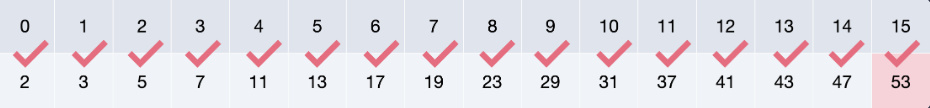

+ 숫자 53을 찾아볼게요. 

+ `선형 탐색`을 한다면 앞에서부터 하나씩 비교하니까 총 16번을 비교해요.

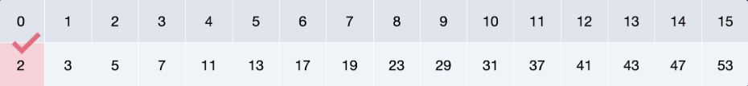

+ 이번엔 숫자 2를 찾아볼까요? 

+ 이때는 맨 앞에 있어서 한 번만 비교하면 됩니다.

+ 사실 우리가 찾는 숫자의 위치는 첫 번째일 수도 있고, 두 번째, 세 번째, …, 열 여섯 번째일 수도 있습니다. 

+ 다 합해서 16가지의 경우가 있어요. 

+ 평균 비교 횟수는 이 각각의 경우에 대해서 비교 횟수를 구해서 더하고 총 경우의 수에 해당하는 16으로 나누면 구할 수 있죠.

+ 이번 레슨에서는 이렇게 평균적인 경우를 살펴볼 건데요. 

+ `선형 탐색`과 `이진 탐색`의 평균 비교 횟수를 대략적으로 구해 봅시다.

# 선형 탐색의 평균 비교 횟수

+ 16개의 정렬된 숫자가 들어 있는 리스트가 있다고 해 볼게요. 

+ 우리 목표는 우리가 찾는 숫자가 첫 번째에 있는지, 두 번째에 있는지, …, 열 여섯 번째에 있는지 총 16가지 경우에 대해서 비교하는 횟수를 구하고 이것의 평균을 구하는 겁니다.

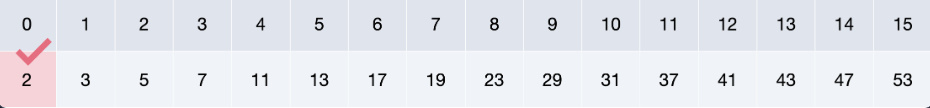

+ 0번 인덱스에 우리가 찾는 숫자가 있다면, 비교는 1번만 하면 됩니다.

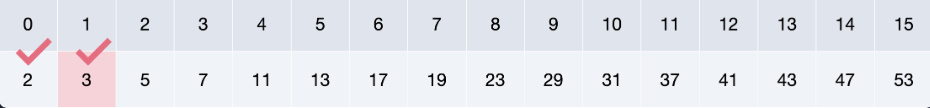

+ 1번 인덱스에 우리가 찾는 숫자가 있다면, 비교는 2번 하면 됩니다.

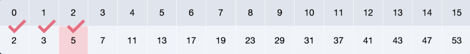

+ 2번 인덱스에 우리가 찾는 숫자가 있다면, 비교는 3번 하면 됩니다. 

+ 혹시 규칙성을 찾으셨나요? 1, 2, 3 이렇게 횟수가 늘어나죠?

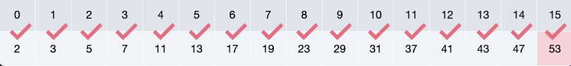

+ 그래서 같은 방식으로 15번 인덱스에 있을 때를 생각해 보면 비교는 16번 하게 됩니다.

+ 자. 이렇게 비교한 횟수를 모두 더하고, 경우의 수가 16가지이니까 16을 나누어 주면 다음과 같습니다.

+ `선형 탐색`에선 평균적으로는 8.5번 비교하네요.

# 이진 탐색의 평균 비교 횟수

+ 이진 탐색에서는 숫자를 비교할 때마다 범위가 반씩 줄어듭니다. 

+ 매번 중간에 있는 숫자를 찾는 숫자랑 비교하는 걸 반복하는데요. 

+ 여기에서 힌트를 얻어서 중간에 있는 숫자를 기준으로 모든 경우를 나열해 보겠습니다.

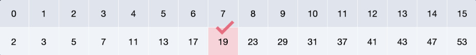

+ 가장 먼저 찾는 숫자가 중간에 있는 경우입니다. 

+ 이때는 숫자를 한 번만 비교하면 됩니다. 

+ 한 번만 비교하는 경우가 한 가지 있습니다. (1 X 1)

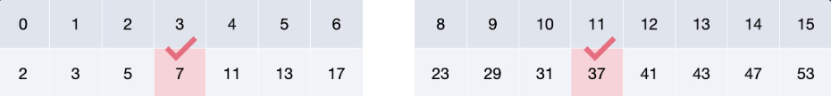

+ 이번에는 찾는 숫자가 1/4지점, 3/4지점에 있는 경우입니다. 

+ 한 번 비교를 하고 나서 범위가 줄어들고, 더 좁은 범위에서 중간에 있는 값들(3번 인덱스와 11번 인덱스의 값)을 비교하는 경우인데요. 

+ 2번 비교를 하는 경우가 2가지 입니다. (2 X 2)

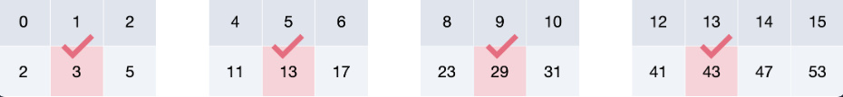

+ 다음 단계를 생각해 볼게요. 

+ 이번에는 찾는 숫자가 1/8, 3/8, 5/8, 7/8 지점에 있는 경우입니다. 

+ 마찬가지로 먼저 두 번을 비교하고 나서 좁아진 범위에서 한 번 더 비교를 하면 찾을 수 있는데요. 

+ 그래서 각각 3번을 비교해야 합니다. 

+ 3번 비교를 하는 경우가 4가지 있네요. (3 X 4)

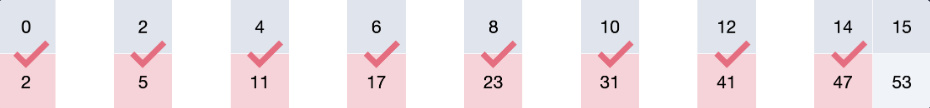

+ 이번에는 찾는 숫자가 1/16, 3/16, 5/16, … 15/16 지점에 있는 경우를 봅시다. 

+ 먼저 세 번을 비교하고 나서 범위가 아주 좁아진 상태죠? 

+ 범위가 좁더라도 비교를 해야 하니까 4번을 비교해야 하는 경우가 8가지 있습니다. (4 X 8)

+ 마지막으로 찾는 숫자가 15번 인덱스에 있는 경우가 남았습니다. 

+ 이 경우엔 4번 비교를 하고 마지막으로 한 번 더 비교해 줘야 하는데요, 5번 비교하는 경우가 한 가지 있네요. (5 X 1)

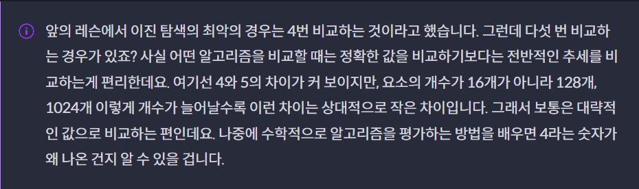

+ 자 이렇게 우리가 찾는 숫자가 있을 수 있는 모든 경우의 수에 대해서 숫자를 몇 번 비교해야 하는지 구해 봤는데요. 

+ 이 값을 더하고 모든 경우의 수는 16가지니까 16으로 나눠서 평균 값을 구해 볼게요.

+ 이진 탐색에서는 평균적으로는 3.375번 비교하네요. 

+ 이런 식으로 최악의 경우 말고 평균적인 경우로 알고리즘을 비교할 수도 있습니다.

# 마무리

+ 평균적인 비교 횟수를 간단하게나마 구해 봤는데요.

+ 사실 어떤 알고리즘에 대해서 엄밀하게 비교하려면 수학적으로 꽤 복잡합니다. 

+ 알고리즘 공부를 시작하는 단계라면 수학적인 내용에 집착하는 것보다는 일단 이 정도의 깊이로 이해하고 넘어가는 걸 추천드려요. 

+ 알고리즘을 비교하는 방식에는 어떤 것이 있고(최악, 평균, 최선의 경우), 평균적인 경우를 비교한다는 것이 어떤 의미인지만 잘 알고 넘어갑시다.