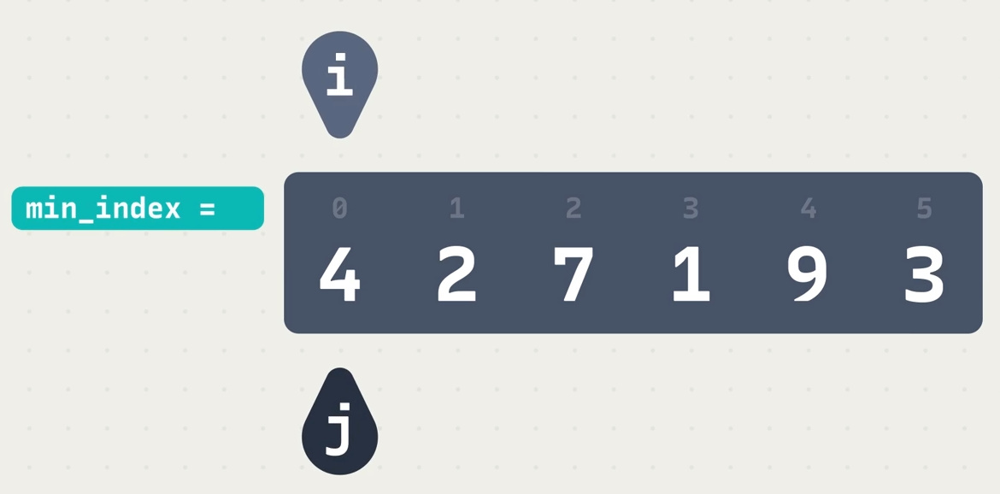

# 선택 정렬

    1. 리스트를 살펴보면서 가장 작은 값을 인덱스 0에 넣어 준다.

    2. 범위를 좁혀서 반복하면 리스트가 정렬 된다.

+ 선택 정렬에는 **핵심적인 변수 3가지**가 필요하다.

+ 위에서 `i`와 `j`는 리스트를 돌아보는 느낌이고

+ `min_index=`는 리스트를 돌던 중에 현재까지의 최솟값의 인덱스를 기록해두는 역할