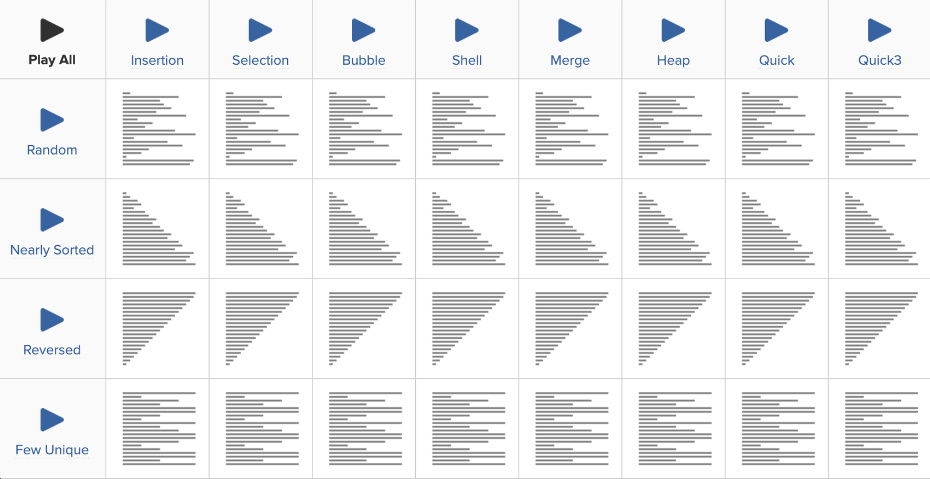
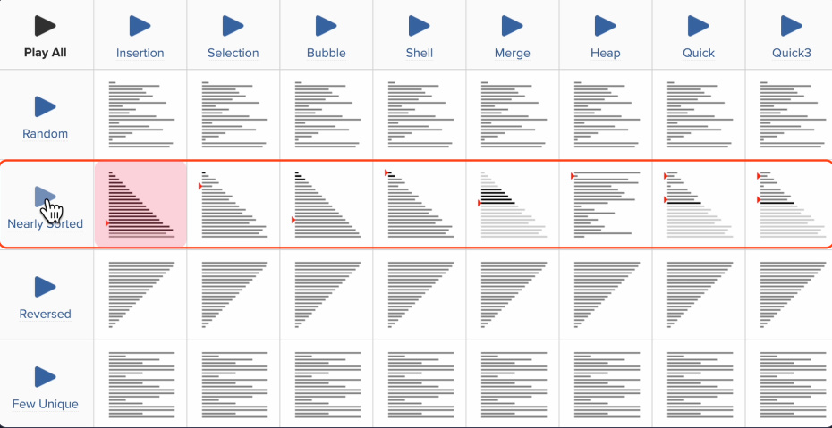
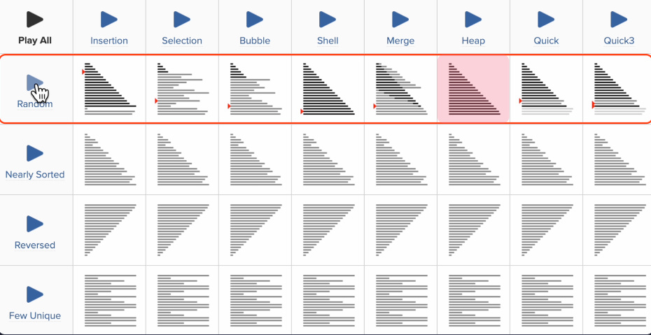

+ 이번 챕터에서는 선택 정렬과 삽입 정렬 두 가지 정렬 알고리즘에 대해 알아봤는데요, 

+ 이 외에도 `퀵 정렬`, `힙 정렬`, `병합 정렬`, `버블 정렬` 등 수많은 정렬 알고리즘이 있습니다. 

+ **여기서 가장 효율적인 알고리즘은 뭘까요?**

+ 앞에서 똑같은 알고리즘이라도 주어진 상황에 따라 최악의 경우, 최상의 경우가 있다는 걸 살펴봤었습니다. 

+ 다양한 상황에서 각 알고리즘이 어떻게 동작하는지 애니메이션으로 비교할 수 있게 해주는 사이트([Sorting Algorithms Animations - Total](https://www.toptal.com/developers/sorting-algorithms))가 있어요.

+ 보시면 표로 되어 있는데요. 

+ 위에서부터 
    + **랜덤 순서일 때(Random)**
    + **거의 정렬되어 있을 때(Nearly Sorted)**
    + **거꾸로 정렬이 되어 있을 때(Reversed)**
    + **중복된 숫자가 많을 때(Few Unique)**

+ 총 네 가지 조건에서 각 정렬 알고리즘을 비교해서 보여 줍니다.

+ 리스트가 이미 거의 정렬되어 있다면 `삽입 정렬(Insertion)`이 가장 효율적입니다.

+ 요소가 랜덤 순서일 때 `힙 정렬(heap sort)`이라는 게 가장 빠릅니다.

+ 완전히 거꾸로 된 리스트의 경우 삽입 정렬은 엄청 오랜 시간이 걸리네요. 

+ 그리고 선택 정렬과 병합 정렬은 거의 비슷한 시간이 걸립니다.

+ 여기서 알 수 있는건 모든 상황에 대해 가장 효율적인 정렬 알고리즘은 없다는 것인데요. 

+ 각 알고리즘의 장단점을 이해하고 상황에 따라 적합한 것으로 선택할 수 있으면 좋겠죠?

### 프로그래밍 언어의 기본 정렬 함수

+ 파이썬이나 자바스크립트, 자바 같은 프로그래밍 언어에는 기본적으로 제공하는 정렬 함수가 있습니다. 

+ 예를 들어서 파이썬에서는 `list.sort()` 함수가 있는데요. 

+ 이런 기본 정렬 함수에서는 어떤 알고리즘을 기본으로 사용할까요? 

+ 파이썬과 자바스크립트에서는 `삽입 정렬(insertion sort)`과 `합병 정렬(merge sort)`의 하이브리드인` 팀소트(timsort)라는 알고리즘을 사용`한다고 해요.

+ 두 알고리즘의 장점을 살려 다양한 경우에서 사용할 수 있도록 최적화된 알고리즘이랍니다. 

+ 반면 자바에서는 두 개의 피봇으로 하는 `퀵 정렬(dual-pivot quicksort)`을 쓴다고 해요.