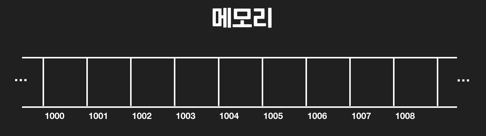

+ 메모리는 하나의 긴 띠라고도 표현했는데요. 이 띠는 

    + 일정한 칸으로 나눠져 있고
    
    + 각 칸에 데이터를 저장할 수 있고

    + 각 칸은 자신만의 주소가 있습니다

+ 이 메모리 한 칸이 저장할 수 있는 가장 기본적인 용량의 단위는 바이트, 영어로는 `byte`입니다. 

+ 자료 구조를 공부하면서 바이트라는 단위가 정확히 얼만큼의 정보를 저장하는 단위인지는 모르셔도 됩니다. 

+ 그냥 엄청 작은 단위라고만 알고 계시면 됩니다.

+ 바이트가 아닌 다른 크기의 용량을 담는 저장 장치들도 있긴 한데요. **대부분의 현대 컴퓨터 시스템들은 메모리 한 칸에 바이트만큼의 데이터를 저장**합니다.

+ 일상 생활 속에서도 많은 분들께서 이미 바이트라는 용어를 들어보셨을 텐데요. 흔히 영상, 문서, 음성 파일이나, RAM 또는 컴퓨터의 스토리지의 크기를 표현할 때,

    + 160 킬로 바이트(kB)

    + 10 메가 바이트(MB)

    + 32 기가 바이트(GB)

+ 이런 식으로 많이 표현하는데요. 킬로 바이트, 메가 바이트, 기가 바이트는 그냥 데이터의 용량이 몇 바이트인지 표현한 겁니다. 정확히 얘기하자면,

    + 킬로 바이트 = 1,000 바이트

    + 메가 바이트 = 1,000,000 바이트

    + 기가 바이트 = 1,000,000,000 바이트

+ 이만큼의 저장 공간 용량들이죠.

+ 자료 구조를 배우면서 바이트나 다른 저장 공간 단위들을 심도 있게 다루지는 않을 건데요. 그래도 자료 구조에서는 이해하면 도움이 되는 개념/용어이니까,

    1. 바이트는 컴퓨터 저장 공간 용량을 나타내는 단위다.

    2. 메모리 한 칸에 담기는 데이터 용량은 1 바이트다.

+ d이 정도는 이해하고 넘어가시면 나중에 나오는 내용을 이해하는 데 조금 더 수월할 거예요!