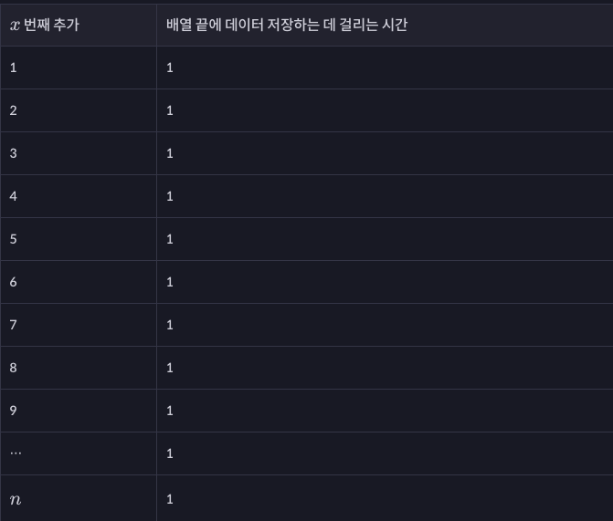
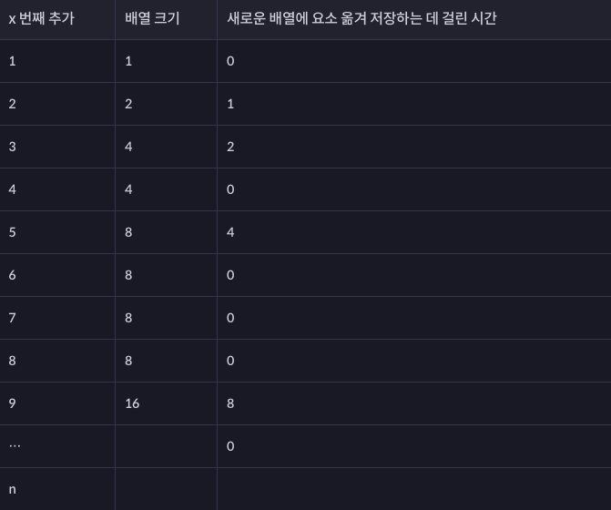
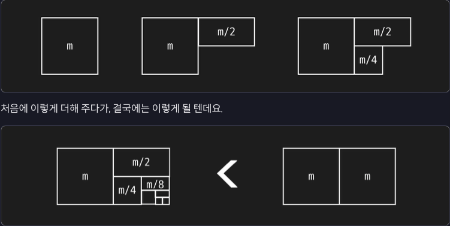

# 분할 상환 분석 (Amortized Analysis) == 할부

+ 같은 동작을 $ㅇn$번 했을 때 드는 시간이 $x$일때:

    동작을 한 번 하는 데 걸린 시간: $\frac{x}{n}$

+ 시간 복잡도를 최악의 경우로 얘기하지 말고

+ 평균을 내어서 조금 더 합리적으로 시간 복잡도를 분석하는 방식

---

## 동적 배열 동작

+ 동적 배열에 추가를 할 때는:

    1. 새로운 인덱스에 데이터를 저장하는 시간

    2. 기존 배열의 크기가 부족해서 더 큰 배열을 만들고, 기존 배열의 데이터들을 옮기는 시간

+ 이 두 가지를 나눠서 생각하면 편합니다.

+ 우선 기억을 상기시키기 위해서 동적 배열에 데이터를 추가할 때 일어나는 일들을 쭉 나열해 볼게요.

+ 비어 있는 동적 배열에 추가 연산을 9번 한다고 가정합시다. 처음 시작할 때 동적 배열은 크기가 1인 배열입니다.

    1. 첫 번째 요소 추가:

        + 그냥 새로운 데이터를 저장합니다.

    2. 두 번째 요소 추가:

        + 배열이 꽉 찼습니다. 
        
        + 크기가 2인 배열을 새로 만들고 기존 데이터를 옮겨 저장합니다 (1 개 옮겨 저장)

        + 맨 뒤 인덱스에 새로운 데이터를 저장합니다.

    3. 세 번째 요소 추가:

        + 배열이 꽉 찼습니다. 
        
        + 크기가 4인 배열을 새로 만들고 기존 데이터를 옮겨 저장합니다 (2 개 옮겨 저장)

        + 맨 뒤 인덱스에 새로운 데이터를 저장합니다.

    4. 네 번째 요소 추가

        + 맨 뒤 인덱스에 새로운 데이터를 저장합니다.

    5. 다섯 번째 요소 추가

        + 배열이 꽉 찼습니다. 
        
        + 크기가 8인 배열을 새로 만들고 기존 데이터를 옮겨 저장합니다 (4 개 옮겨 저장)

        + 맨 뒤 인덱스에 새로운 데이터를 저장합니다.

    6. 여섯 번째 요소 추가

        + 맨 뒤 인덱스에 새로운 데이터를 저장합니다.

    7. 일곱 번째 요소 추가

        + 맨 뒤 인덱스에 새로운 데이터를 저장합니다.

    8. 여덟 번째 요소 추가

        + 맨 뒤 인덱스에 새로운 데이터를 저장합니다.

    9. 아홉 번째 요소 추가

        + 배열이 꽉 찼습니다. 
        
        + 크기가 16인 배열을 새로만들고 기존 데이터를 옮겨 저장합니다 (8 개 옮겨 저장)

        + 맨 뒤 인덱스에 새로운 데이터를 저장합니다.

+ 이런 식으로 내부 배열이 꽉 찼을 때는 새로운 배열을 만들고, 기존 요소들을 복사하고, 새로운 요소를 저장하면 됩니다. 

+ 그리고 배열에 여유가 있으면 그냥 새로운 요소만 저장하면 되죠?

# 분할 상환 분석

+ 분할 상환 분석을 하면 이 동작을 $n$번 반복한다고 가정합니다. 

+ 총 걸리는 시간을 계산하기 쉽게 두 가지로 나눠서 생각해 볼 거라고 했잖아요?

    1. 새로운 데이터를 동적 배열 맨 끝에 단순히 저장하는 데 걸리는 시간

    2. 더 큰 배열을 만들고 그 배열에 기존의 데이터를 옮기는 데 걸리는 시간

+ 걸리는 두 시간을 각각 따로 계산해 볼게요.

### 배열 끝에 새로운 데이터 저장하는 데 걸리는 시간

+ 먼저 새로운 데이터를 저장하는 데 걸리는 총 시간에 대해서 생각해 봅시다.

+ 인덱스에 데이터를 저장하는 데 걸리는 시간은 1이라고 했잖아요?

+ 이걸 총 $n$번 하는 거니까  $O(n)$이 걸립니다

### 새로운 배열에 데이터를 옮기는 시간

+ 이번에는 내부 배열이 꽉 차서 기존 데이터를 복사하는 데 걸리는 시간에 대해서 생각해 봅시다. 이 부분이 좀 어려우니까 집중해서 보세요.

+ 새로운 배열에 기존 데이터를 옮겨 저장하는 시간은 위 표에 나와 있는대로 소요됩니다.

+ 표를 살펴봅시다. 2 번째, 3 번째, 5 번째, 9 번째 추가 때 배열의 크기를 늘려야 합니다. 

+ 그럴 때마다 데이터를 옮겨야 하는데요. 이때 데이터를 각각 $1, 2, 4, 8$ 개씩 복사하고 붙여 넣습니다.

+ 데이터를 복사해서 붙여 넣는 총 시간 비용은 이 시간들을 더한 $8 + 4 + 2 + 1$ 인데요. 좀 더 일반화해서 생각할까요?

+ 추가 연산을 $n$ 번 했을 때, 가장 마지막에 데이터를 $m$ 개 옮겨서 저장했다고 합시다.

+ 그럼 데이터를 복사해서 저장하는 데 걸린 총 시간은 : 

    $m + \frac{m}{2} + \frac{m}{4} + ... + 1$

+ 이렇게 표현할 수 있는데요. 이걸 도형으로 나타내 볼게요. 이런 식으로 처음에 $m$ 이 있고 그 다음에 계속 반으로 줄어든 값을 더해 주겠죠?

+ 도형에서 볼 수 있듯이 이런 식으로 어느 자연수든 반씩 줄여서 1까지 계속 더해주면 그 결과는 절대 $2m$ 을 넘을 수 없습니다. 

+ 정확히 말하면 딱 $2m - 1$ 이 되죠.

+ 근데 가장 최근에 데이터를 옮겨 저장할 때 8이 걸렸다는 건 무슨 의미일까요? 

+ 원래 배열의 수용 가능 크기가 8이었지만 크기가 부족해서 16개의 데이터를 담을 수 있는 새로운 배열로 복사했다는 얘기인데요. 

+ 그럼 결국에 현재 배열 안에 있는 데이터는 9개에서 16개 사이라는 말입니다. 16개보다 더 많은 요소가 있으면 가장 최근에 옮겨 저장한 요소의 수가 8이 아니라 16이겠죠?

+ 이 사실을 바탕으로 우리가 일반화할 때 사용했던 배열 안 요소 수 $n$ 과 가장 최근 옮겨 저장한 요소 수 $m$의 관계에 대해서 한 가지 사실을 알아낼 수 있는데요.

+ 가장 최근에 복사하는 데 걸린 시간이 8일 때, 배열 안에 있는 데이터는 9개에서 16개 사이입니다. 즉, $m$ 은 무조건 $n$ 보다 작다고 할 수 있습니다.

+ 추가 연산을 연속으로 $n$ 번 하고, 가장 마지막에 옮겨 저장한 데이터 요소 수를 $m$ 이라고 할 때:

    + 복사해서 저장하는 데 걸리는 총 시간이 $2m - 1$ 이고

    + $m$은 $n$ 보다 작습니다.

+ 이걸 다시 정리해서 나타내면:

> `연속으로 추가 연산을 $n$ 번을 하면 데이터를 옮겨서 저장하는 데 걸리는 총 시간은 $2n$ 보다 작다!`

### 두 경우 합치기

+ 지금까지 나온 내용을 종합해 보면, 동적 배열에 $n$ 개의 데이터를 연속으로 추가하면:

    1. 새로운 데이터를 저장하는 데에는 $n$ 의 시간이 들고,

    2. 데이터를 옮겨 저장하는 데에는 $2n$ 보다 적은 시간이 걸리는데요.

+ 이 두 시간을 합치면 총 드는 시간은 $3n$ 보다 적은 시간이 걸리겠죠? 이걸 시간 복잡도로 표현하면 

+ $O(3n) 그러니까 $O(n)$ 이라고 할 수 있습니다.

+ 근데 이건 추가 연산을 한 번 하는 게 아니라 연속으로 $n$ 번 하는 데 걸리는 시간 복잡도입니다.

+ 그러니까 총 $n$ 번의 추가 연산을 하는 데 걸리는 시간이 $O(n)$인 건데요. 추가 연산을 $n$ 번 하는 데 $O(n)$ 의 시간이 걸리니까 

+ 1 번 하는 데는 $\frac{O(n)}{n}$ 즉, $O(1)$ 이 걸리는 거죠.

+ 전에는 추가 연산이 최악의 경우 $O(n)$ 이 걸린다고 했었는데요. 분할 상환 분석을 하면 $O(1)$ 이 걸린다고 보는 거죠.

### 최악의 경우 분석 vs. 분할 상환 분석 뭘 쓰면 되는 걸까

+ 사실 분할 상환 분석을 한다고 꼭 시간 복잡도가 줄어드는 건 아닙니다. 보통은 할부 개념을 적용해도 시간 복잡도가 줄어들지 않죠.

+ 하지만 만약 최악의 경우보다 분할 상환 분석을 한 시간 복잡도가 더 적다면, 분할 상환 분석을 한 시간 복잡도를 사용합니다. 

+ 그러니까 "**동적 배열의 끝에 데이터를 추가할 때는 $O(1)$이 걸린다.**"라고 표현해도 된다는 거죠.

+ 보통은 혼란을 없애기 위해 좀 더 정확하게:

> `동적 배열의 추가(append) 연산은 최악의 경우 $O(n)$ 이 걸리지만, 분할 상환 분석을 하면 $O(1)$ 이 걸린다.`

+ 라고 표현할 수 있습니다!
