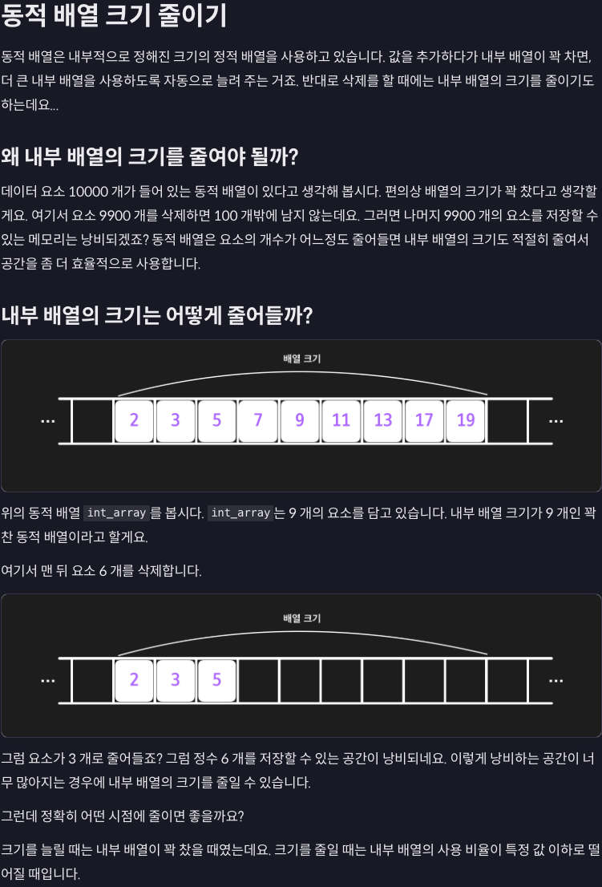
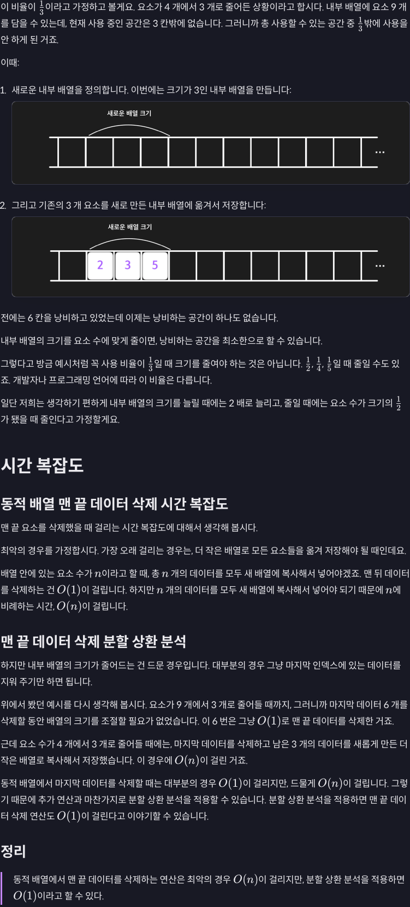

---

## 새로운 배열롱 요소들을 이동시키면 기존의 배열들은 어떻게 될까?

+ 동적 배열에서 내부 배열의 크기를 줄이기 위해 새로운 배열을 생성하고 기존 데이터를 복사한 후, 기존 배열은 **삭제되거나 가비지 컬렉션**(Garbage Collection)으로 처리됩니다. 

+ 이 과정은 사용하는 언어와 메모리 관리 방식에 따라 약간씩 다를 수 있습니다. 아래에서 상세히 설명하겠습니다.

### 기존 배열은 삭제되나요?

#### 1. 메모리 해제 방식

+ `C` 또는 `C++` 같은 수동 메모리 관리 언어에서는:

    + 새로운 배열을 생성한 후 데이터를 복사합니다.

    + 기존 배열은 더 이상 사용되지 않으므로 반드시 `free(C)` 또는 `delete[](C++)`를 호출하여 메모리를 직접 해제해야 합니다.

    + 그렇지 않으면 메모리 누수가 발생합니다.

```c
// 예시: 배열 크기 줄이기
int* oldArray = new int[10];
int* newArray = new int[5];

// 데이터 복사
for (int i = 0; i < 5; i++) {
    newArray[i] = oldArray[i];
}

// 기존 배열 삭제
delete[] oldArray;
oldArray = nullptr;
```

+ `Python`, `Java` 같은 자동 메모리 관리 언어에서는:

    + 새로운 배열이 생성되고 기존 배열의 참조(reference)가 사라지면, 해당 배열은 더 이상 사용되지 않습니다.

    + 이후 가비지 컬렉터가 자동으로 메모리를 회수합니다.

```python
# 예시: 배열 크기 줄이기
old_array = [1, 2, 3, 4, 5, 6, 7, 8, 9, 10]
new_array = old_array[:5]  # 크기 줄이기

# old_array는 더 이상 참조되지 않음
old_array = None  # 가비지 컬렉터가 메모리 회수
```

#### 2. 내부 배열 관리

+ 동적 배열의 크기를 줄이는 것은 메모리를 효율적으로 사용하는 데 중요합니다.

+ 내부 배열은 새로운 배열로 대체되며, 기존 배열은 더 이상 사용되지 않으므로:

    + 수동 메모리 관리 언어에서는 명시적으로 삭제해야 합니다.

    + 자동 메모리 관리 언어에서는 가비지 컬렉션으로 처리됩니다.

#### 3. 삭제 연산과 메모리 관리의 의의

+ 크기를 줄이는 과정에서 새로운 배열을 생성하므로, 추가적인 복사 비용과 메모리 재할당 비용이 발생합니다.

+ 이 비용을 최소화하려면, 동적 배열의 삭제 연산을 효율적으로 설계하거나 사용해야 합니다.

## 결론

+ 기존 배열은 새로운 배열로 대체되며, 수동 관리에서는 해제해야 하고, 자동 관리 언어에서는 가비지 컬렉션으로 삭제됩니다. 

+ 중요한 것은 크기 조정 시 성능과 메모리 효율성 간의 균형을 유지하는 것입니다.

---

# 가비지 컬렉션이란?

### Python과 Java의 가비지 컬렉션 (Garbage Collection)

+ **가비지 컬렉션**(Garbage Collection, GC)은 프로그래밍 언어에서 **더 이상 사용되지 않는 객체나 메모리를 자동으로 회수하는 기능**입니다. 

+ `Python`과 `Java`는 모두 가비지 컬렉션을 제공하지만, 구현 방식과 특징에서 약간의 차이가 있습니다.

### 1. Python의 가비지 컬렉션

### 특징

+ `Python`은 **참조 카운팅**(reference counting)과 **순환 참조 감지**(cycle detection)를 통해 메모리를 관리합니다.

+ `Python`의 GC는 gc 모듈을 통해 동작하며, 개발자가 이를 제어할 수도 있습니다.

### 작동 방식

#### 1. 참조 카운팅 (Reference Counting):

+ 각 객체는 참조되는 횟수(참조 카운트)를 저장합니다.

+ 참조 카운트가 0이 되면, 해당 객체는 더 이상 접근할 수 없으므로 메모리를 해제합니다.

+ 장점: 빠르고 효율적.

+ 단점: 순환 참조(Circular References)를 처리하지 못함.

#### 2. 순환 참조 감지 (Cycle Detection):

+ `Python`은 순환 참조를 감지하고 회수하기 위해 GC 루트를 기반으로 그래프 탐색을 수행합니다.

+ 이 과정은 주기적으로 수행되며, 순환 참조로 인해 참조 카운트가 0이 되지 않는 객체를 회수합니다.

```python
import gc

class Node:
    def __init__(self, value):
        self.value = value
        self.next = None

# 순환 참조 예시
node1 = Node(1)
node2 = Node(2)
node1.next = node2
node2.next = node1

# 순환 참조가 있어도 Python의 GC가 이를 회수
del node1
del node2

# 수동으로 GC 호출
gc.collect()
```

### 장점

+ 자동 메모리 관리로 개발자가 메모리 관리에 신경 쓸 필요가 적음.

+ gc 모듈을 통해 GC를 제어하거나 동작 상태를 모니터링 가능.

### 단점

+ 참조 카운트 갱신이 성능에 영향을 줄 수 있음.

+ 순환 참조 감지로 인해 추가적인 오버헤드 발생.

### 2. Java의 가비지 컬렉션

### 특징

+ `Java`는 **JVM** (Java Virtual Machine)에서 가비지 컬렉션을 처리하며, 프로그래머가 명시적으로 메모리를 해제할 필요가 없습니다.

+ `Java`의 GC는 *Generational Garbage Collection* 방식을 사용하여 성능 최적화를 제공합니다.

### 작동 방식

#### 1. Generational Garbage Collection:

+ Java는 객체를 세대(Generation)로 나누어 관리합니다.

+ Young Generation: 새롭게 생성된 객체가 저장되는 영역.

+ Old Generation: 오래 살아남은 객체가 저장되는 영역.

+ Permanent Generation (PermGen): 클래스 메타데이터가 저장되며, Java 8에서는 Metaspace로 대체됨.

+ 대부분의 객체는 짧은 생명주기를 가지므로, Young Generation에서 빠르게 회수됩니다.

#### 2. GC 알고리즘:

+ Mark-and-Sweep: 사용되지 않는 객체를 식별(Mark)하고 메모리를 해제(Sweep).

+ Copying: 살아남은 객체를 새로운 메모리 영역으로 복사하고, 기존 메모리를 초기화.

+ Compacting: 객체를 이동하여 메모리 단편화를 줄임.

#### 3. GC 이벤트:

+ Minor GC: Young Generation에서 발생. 빠르고 자주 수행.

+ Major GC: Old Generation에서 발생. 더 느리지만 메모리를 더 많이 회수.

```java
public class GarbageCollectionExample {
    public static void main(String[] args) {
        // 객체 생성
        String str = new String("Hello, World!");

        // 객체 참조 해제
        str = null;

        // GC 강제 호출 (JVM이 반드시 실행하지는 않음)
        System.gc();

        System.out.println("Garbage Collection completed.");
    }
}
```

### 장점

+ Generational GC를 통해 성능 최적화.

+ 다양한 GC 알고리즘(Serial, Parallel, G1 GC 등)을 선택하여 애플리케이션 요구사항에 맞춤화 가능.

### 단점

+ GC의 실행 타이밍을 완전히 제어할 수 없음.

+ Stop-the-World 이벤트로 인해 성능 저하 가능.

### Python vs Java 가비지 컬렉션 비교

|특징|	Python|	Java|
|---|---|---|
주요 메커니즘|	참조 카운팅 + 순환 참조 감지|	Generational Garbage Collection
제어 가능성|	gc 모듈로 제어 가능|	JVM이 자동 관리, 제어 어려움
성능 최적화|	기본적으로 간단한 방식, 추가 오버헤드 있음|	세대별 관리로 성능 최적화
Stop-the-World 이벤트|	없음 (명시적 GC 호출 가능)|	일부 GC에서 Stop-the-World 발생
순환 참조|	감지 및 회수 가능|	순환 참조 문제 없음

# 결론

+ `Python`과 `Java`는 각각 가비지 컬렉션을 통해 메모리 관리를 자동화하여 개발자의 부담을 줄입니다. 

    + `Python`은 참조 카운팅과 순환 참조 감지를 사용하며, 
    
    + `Java`는 세대별 관리로 효율성을 높입니다. 
    
+ 두 언어 모두 가비지 컬렉션의 동작을 이해하면 메모리 문제를 예방하고 성능 최적화를 달성하는 데 유리합니다.