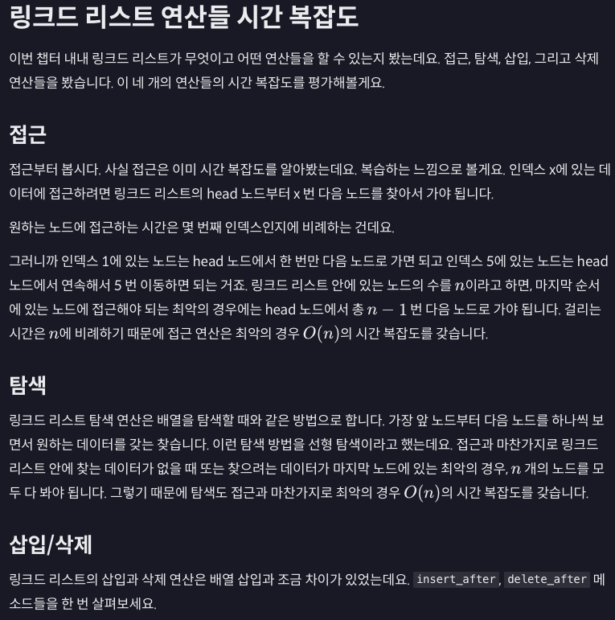
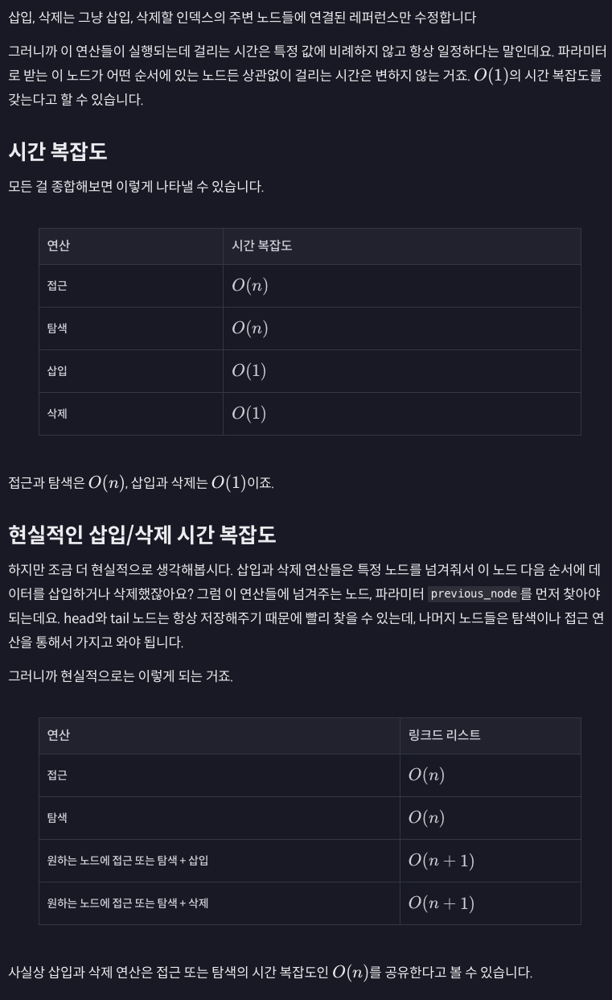
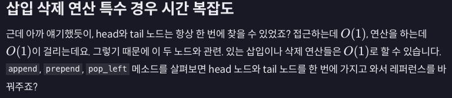
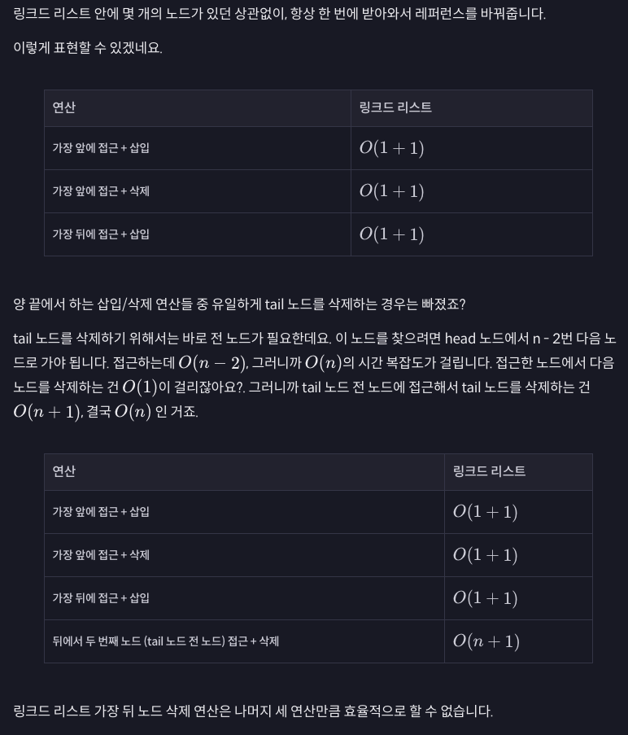

```python
def insert_after(self, previous_node, data):
    """파라미터 data를 데이터로 갖는 새로운 노드를 만들어서 node 파라미터 뒤에 삽입시킨"""
    new_node = Node(data) # 새로운 노드 만들기

    # tail 노드 다음에 새로운 노드를 삽입할 때
    if previous_node == self.tail: 
        previous_node.next = new_node
        self.tail = new_node
    # 두 노드 사이에 새로운 노드를 삽입할 때
    else:
        new_node.next = previous_node.next
        previous_node.next = new_node

def delete_after(self, previous_node):
    """파라미터로 받은 노드 다음 노드를 삭제한다. 단, 파라미터 previous노드로 인해서 에러는 안 난다고 가정한다"""
    data = previous_node.next.data

    # 지우려는 노드가 tail 노드일 때
    if previous_node.next == self.tail:
        self.tail = previous_node
        self.tail.next = None
    # 두 노드 사이의 노드를 지울 
    else:
        previous_node.next = previous_node.next.next

    return data
```



```python
def pop_left(self):
    """링크드 리스트의 가장 앞 노드를 삭제해주는 메소드, 단 링크드 리스트에 항상 노드가 있다고 가정한다"""
    data = self.head.data  # 삭제할 노드를 미리 저장해놓는다

    # 지우려는 데이터가 링크드 리스트의 마지막 남 데이터일 때
    if self.head is self.tail:
        self.head = None
        self.tail = None
    else:
        self.head = self.head.next

    return data  # 삭제된 노드의 데이터를 리턴한다


def prepend(self, data):
    """링크드 리스트의 가장 앞에 데이터 삽입"""
    new_node = Node(data)  # 새로운 노드를 만든다

    # 링크드 리스트가 비었는지 확인
    if self.head is None:
        self.tail = new_node
    else:
        new_node.next = self.head   # 새로운 노드의 다음 노드를 head 노드로 정해주고

    self.head = new_node   # 리스트의 head_node를 새롭게 삽입한 노드로 정해준다


def append(self, data):
    """파라미터로 받은 데이터를 갖는 노드를 생성한다"""
    new_node = Node(data)

    # 링크드 리스트가 비어 있으면 새로운 노드가 링크드 리스트의 처음이자 마지막 노드다
    if self.head == None:
        self.head = new_node
        self.tail = new_node
    # 링크드 리스트가 비어 있지 않으면
    else:
        self.tail.next = new_node  # 가장 마지막 노드 뒤에 새로운 노드를 추가하고
        self.tail = new_node  # 마지막 노드를 추가한 노드로 바꿔준다
```

