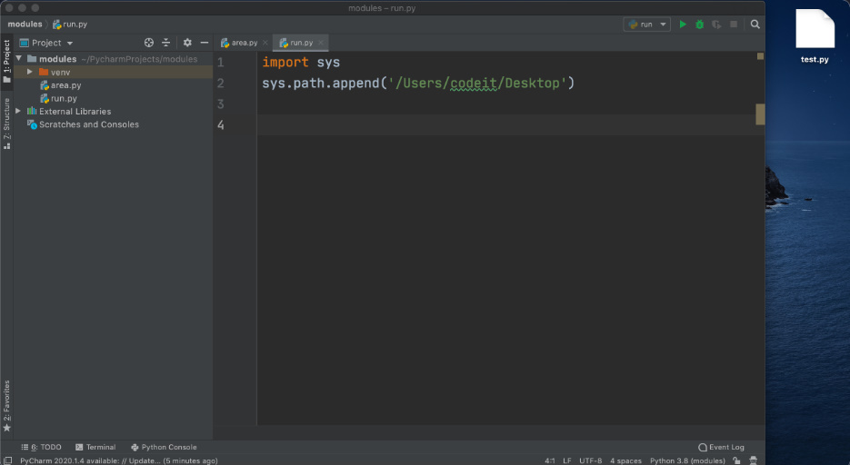
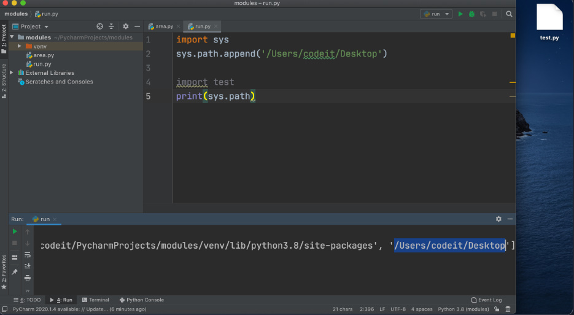
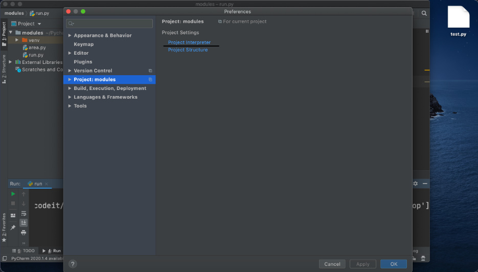
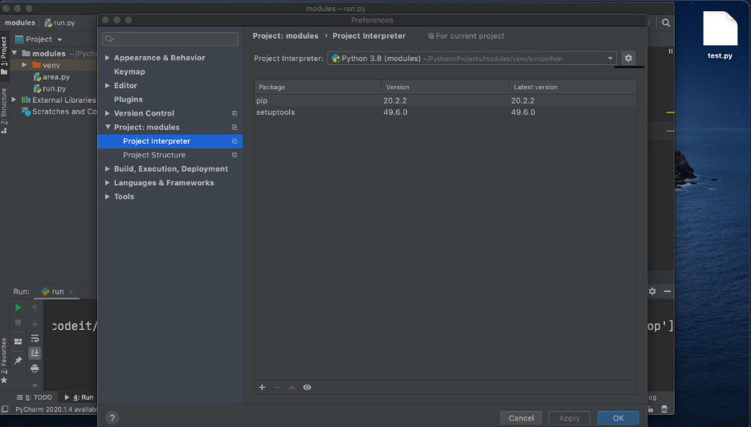
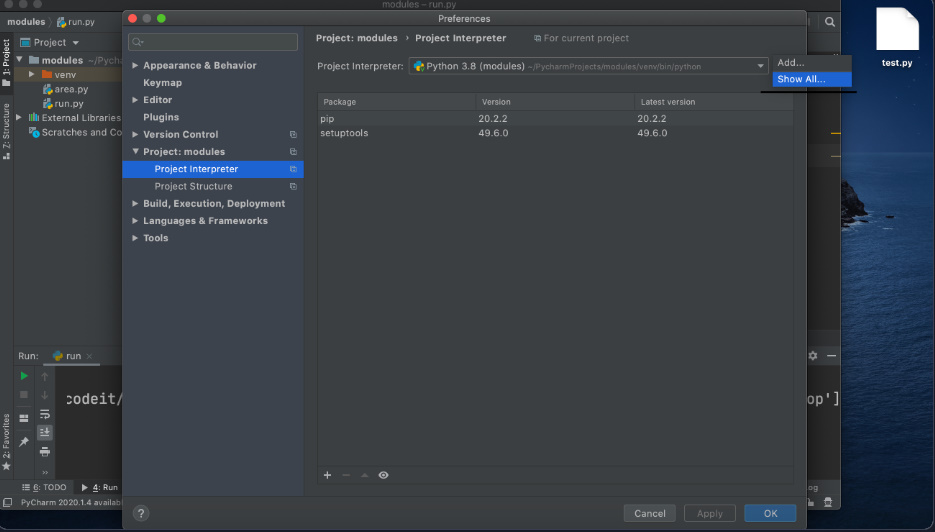
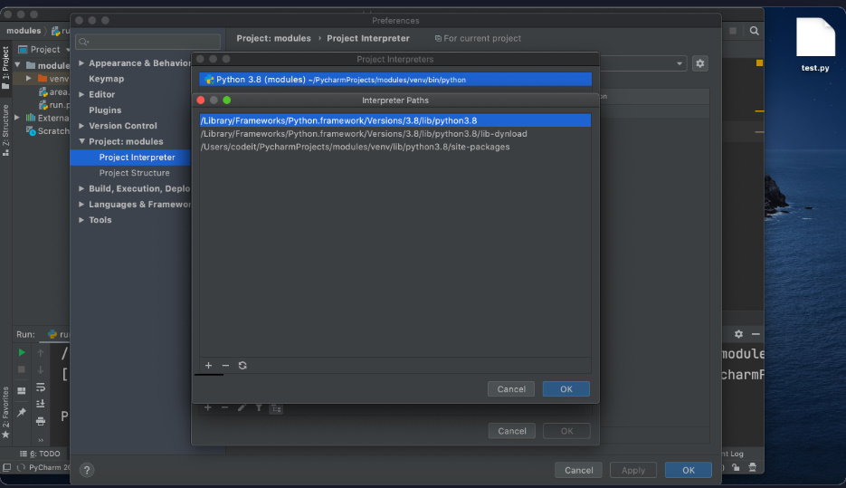
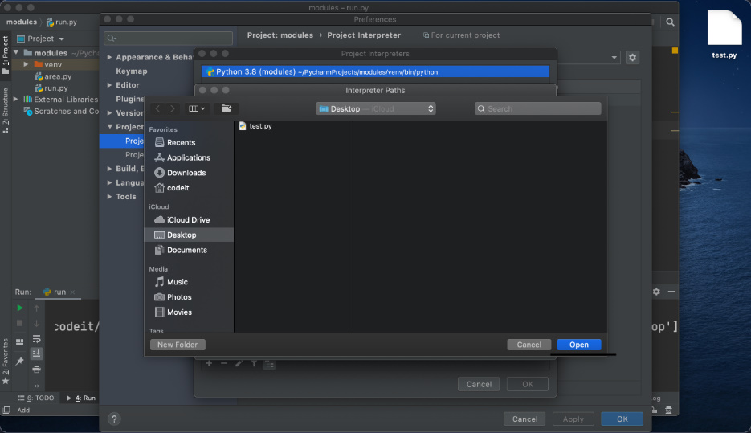
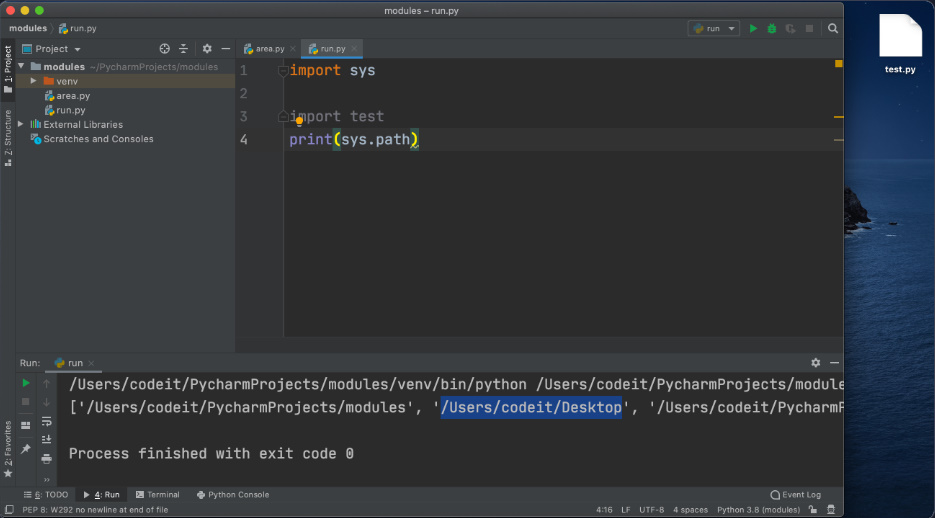

+ 저번 영상에서는 모듈 검색 경로에 대해 알아봤습니다. 

+ 파이썬은 임포트하려는 모듈을 찾기 위해서 `sys.path`라는 리스트에 있는 경로들을 살펴보는데요. 

+ 이번 레슨에서는 `sys.path`에 새로운 경로를 추가하는 방법들을 알아보겠습니다.

# `sys.path`에 `.append()`로 경로 추가

+ 첫 번째 방법은 `sys.path`에 새로운 경로를 직접 추가하는 것입니다. 

+ `sys.path`는 결국 리스트이기 때문에 `.append()` 함수를 써서 쉽게 새로운 경로를 추가할 수 있습니다.

+ 예를 들어 `sys.path`에 바탕 화면의 경로를 추가하고 싶다면 아래와 같은 코드를 추가해 주면 됩니다. 

```python
import sys
sys.path.append('/Users/codeit/Desktop') # macOS
sys.path.append('C:\\Users\\codeit\\Desktop') # Windows
```

+ 윈도우스의 경로 같은 경우 역슬래시를 2개 써 주는데요. 

+ 프로그래밍에서는 `\<char>` 패턴을 가진 특수 문자들이 있습니다. 

+ 예를 들어 `\t`는 탭을 뜻하고 `\n`은 새로운 줄을 뜻합니다. 

+ 윈도우스 파일 경로는 `\`가 들어가기 때문에 `\`와 다음 문자가 특수 문자로 인식될 수 있겠죠? 

+ 그래서 윈도우스 파일 경로를 다룰 때는 `\`를 뜻하는 특수 문자, `\\`를 사용해야 합니다.

+ 그러면 이제 임포트하고 자 하는 모듈을 찾을 때 바탕 화면도 찾아보겠죠? '

+ 예를 들어 바탕화면에 `test.py`라는 새로운 파일을 만들고:



+ `test` 모듈을 `run` 파일에서 임포트해 주면 *(임포트 문은 바탕 화면의 경로가 sys.path에 추가된 후에 실행돼야 합니다)* 아무 오류 없이 모듈이 임포트됩니다.


+ 그리고 바탕화면의 경로가 `sys.path`에 추가된 걸 확인할 수 있습니다.



# `sys.path`에 영구적으로 경로 추가

+ `sys.path`에 어떤 경로를 `append()`해 주면 프로그램이 종료되면 그 경로는 `sys.path`에서 사라집니다. 

+ 그 경로에 있는 모듈을 쓰고 싶으면 매번 `append()`를 해 줘야 합니다.

+ 그럼 어떤 경로를 영구적으로 `sys.path`에 추가하려면 어떻게 해야 할까요?

+ `PyCharm`의 설정 (Windows: File → Settings, macOS: PyCharm → Preferences)으로 가서 `Project 탭` 안에 있는 `Project Interpreter`를 클릭해 줍니다.



+ 그리고 톱니바퀴 버튼을 누른 후 `Show All` 옵션을 클릭해 줍니다.




+ 그런 다음에 파일 경로 아이콘을 클릭해 줍니다.


+ 그리고 `+` 아이콘을 누른 후 원하는 경로를 추가해 줍니다 (밑에 사진은 바탕 화면의 경로를 추가해 줍니다).




+ 그리고 OK를 눌러줍니다.


+ 그러면 이제 코드에서 `sys.path.append()`를 지워도 바탕 화면에 있는 `test` 모듈이 임포트됩니다. 

+ 그리고 `sys.path`에 바탕 화면의 경로가 나오는 걸 확인할 수 있습니다.

