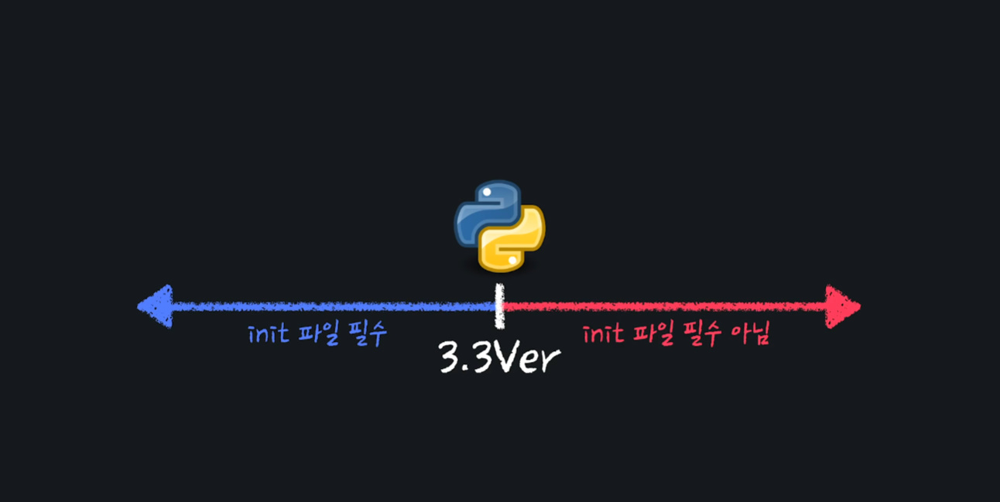

# __init__.py 파일이란?



+ 간단하게 말해서 `"이 폴더는 파이썬 패키지다."` 라고 말해 주는 파일

+ `init`은 `'initialize'`의 줄임말로 초기화를 뜻한다.

+ 다시 말해서, **패키지를 초기화 할 때 사용하는 파일**이다

+ 우리가 처음으로 패키지나, 패키지 안에 있는 어떤 것을 임포트 하면

+ 가장 먼저 이 `__init__.py` 파일에 있는 코드가 실행된다

+ `__init__.py` 에 간단한 코드를 작성하고

```python
# __init__.py

print("__init__.py 파일 실행")
```

+ `Test.py` 파일에서 `__init__.py` 파일을 임포트만 해준뒤 실행을 하게 되면
```python
# Test.py 

import Shapes

"""
__init__.py 파일 실행
"""
```
+ 위 `__init__.py` 파일 실행 이라는 결괏값이 자동으로 출력된다.