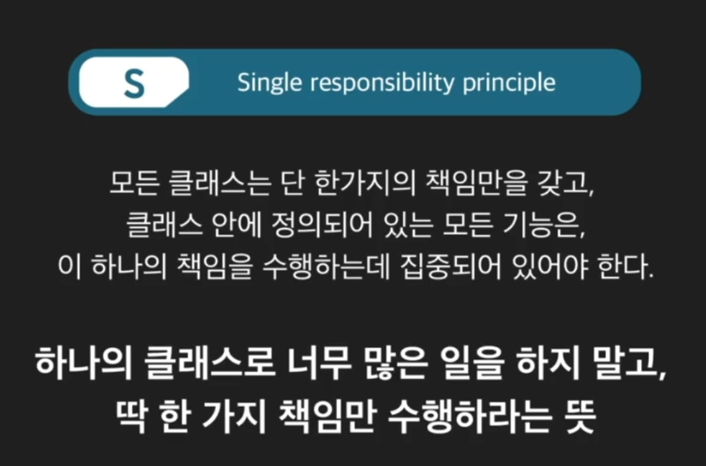
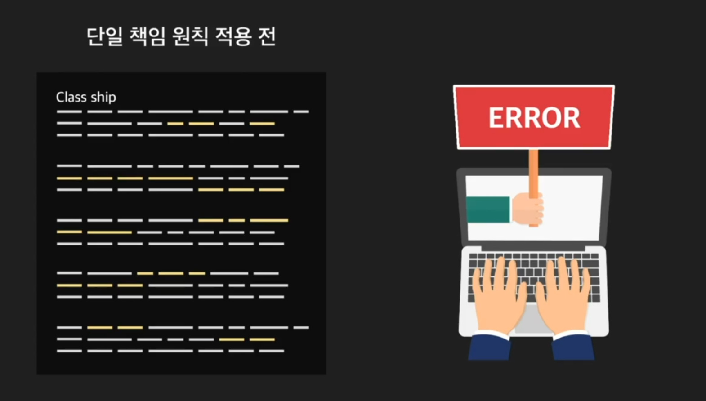
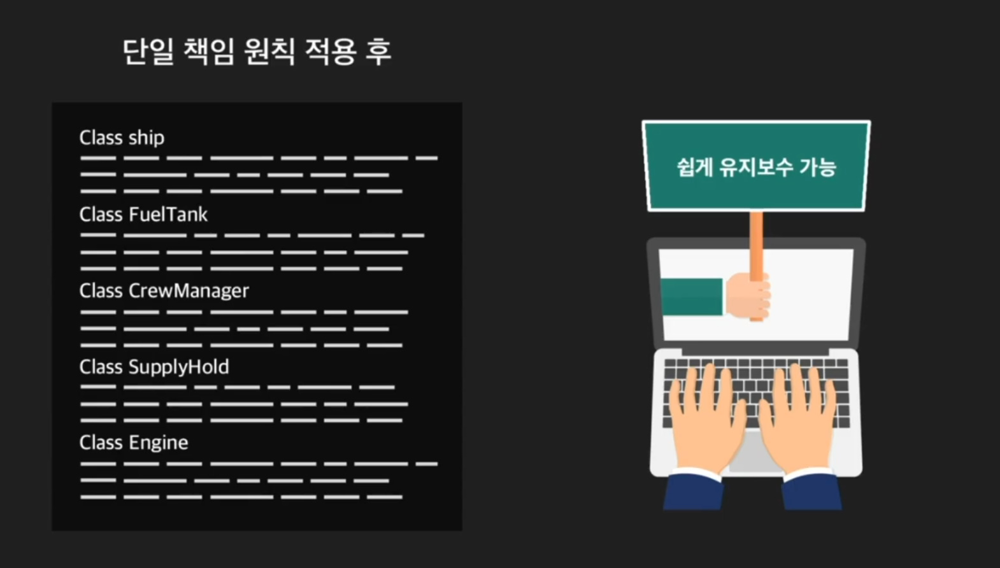
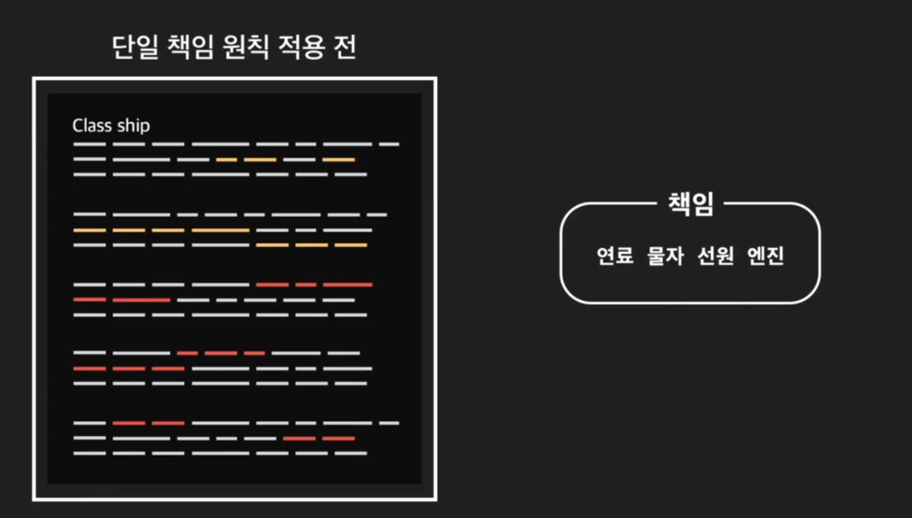
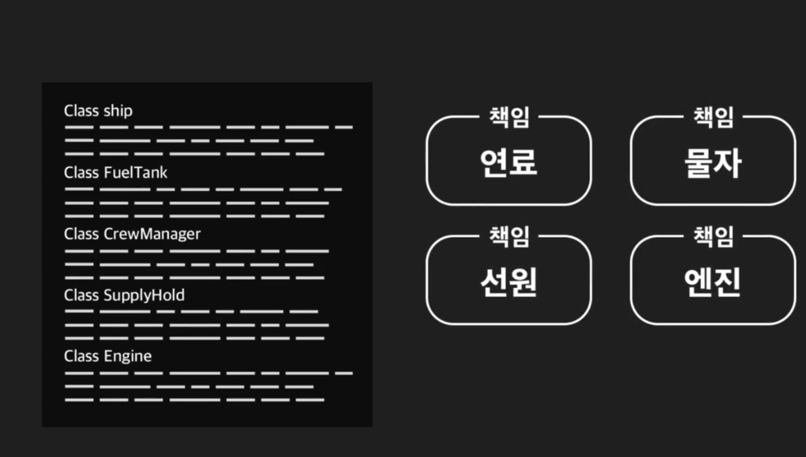
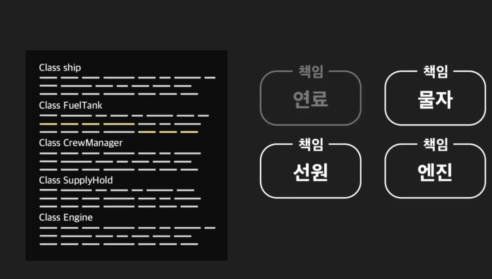
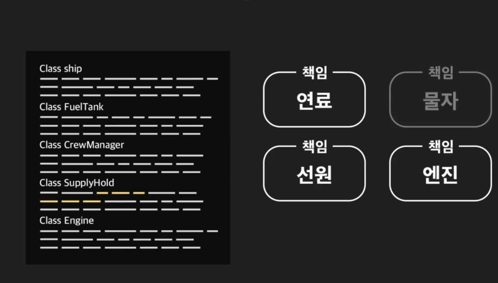
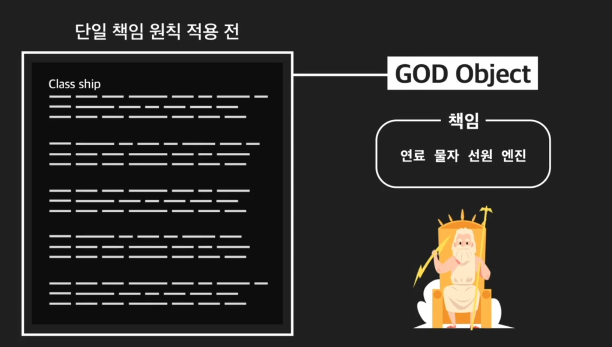

```python
class Ship:
    """배 클래스"""
    def __init__(self, fuel, fuel_per_hour, supplies, num_crew):
        """연료량, 시간당 연료 소비량, 물자량, 선원 수를 인스턴스 변수로 갖는다"""
        self.fuel = fuel
        self.fuel_per_hour = fuel_per_hour
        self.supplies = supplies
        self.num_crew = num_crew

    def report_fuel(self):
        """연료량 보고 메소드"""
        print("현재 연료는 {}l 남아 있습니다".format(self.fuel))

    def load_fuel(self, amount):
        """연료 충전 메소드"""
        self.fuel += amount

    def report_supplies(self):
        """물자량 보고 메소드"""
        print("현재 물자는 {}명분이 남아 있습니다".format(self.supplies))

    def load_supplies(self, amount):
        """물자 보급 메소드"""
        self.supplies += amount

    def distribute_supplies_to_crew(self):
        """물자 배분 메소드"""
        if self.supplies >= self.num_crew:
            self.supplies -= self.num_crew
            return True
        print("물자가 부족하기 때문에 배분할 수 없습니다")
        return False

    def report_crew(self):
        """선원 수 보고 메소드"""
        print("현재 선원 {}명이 있습니다".format(self.num_crew))

    def load_crew(self, number):
        """선원 승선 메소드"""
        self.num_crew += number

    def run_engine_for_hours(self, hours):
        """엔진 작동 메소드"""
        if self.fuel > self.fuel_per_hour * hours:
            self.fuel -= self.fuel_per_hour * hours
            print("엔진을 {}시간 동안 돌립니다!".format(hours))
        else:
            print("연료가 부족하기 때문에 엔진 작동을 시작할 수 없습니다")
            
# ship 인스턴스 생성        
ship = Ship(400, 1, 1000, 50)

# ship 인스턴스 추가 연료 보충
ship.load_fuel(10)

# ship 인스턴스 추가 물자 보급
ship.load_supplies(10)

# ship 인스턴스의 추가 선원 승선
ship.load_crew(10)

# ship 인스턴스내 물자 배급
ship.distribute_supplies_to_crew()

# ship 인스턴스 엔진 작동
ship.run_engine_for_hours(4)

# ship 인스턴스 연료량 보고
ship.report_fuel()

# ship 인스턴스 물자량 보고
ship.report_supplies()

# ship 인스턴스 승선 수 보고
ship.report_crew()
```
```python
"""
Print Output:

엔진을 4시간 동안 돌립니다!
현재 연료는 406l 남아 있습니다
현재 물자는 950명분이 남아 있습니다
현재 선원 60명이 있습니다

Variables:
-{
    Ship: -{
        py/type: "__main__.Ship"
    },
    ship: -{
        py/object: "__main__.Ship",
        fuel: 406,
        fuel_per_hour: 1,
        supplies: 950,
        num_crew: 60
    }
}
"""
```
# GOD_Object란?

+ 하나의 클래스가 여러가지의 책임을 직접 수행하는 모습이 마치 신과 같다. 라고 해서 붙여진 이름





