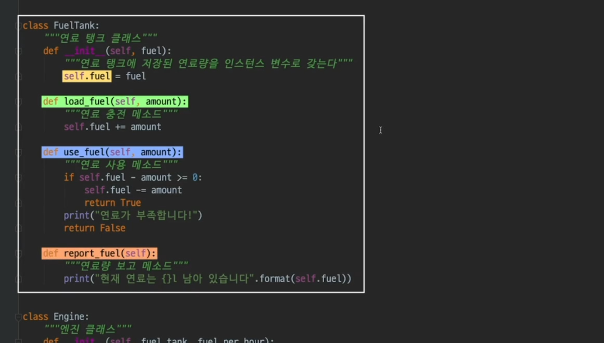
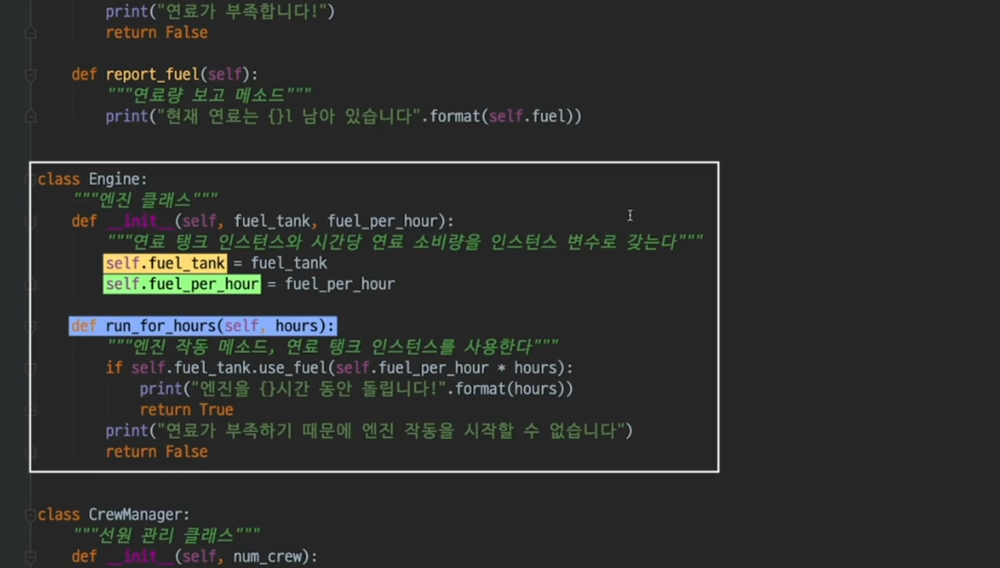
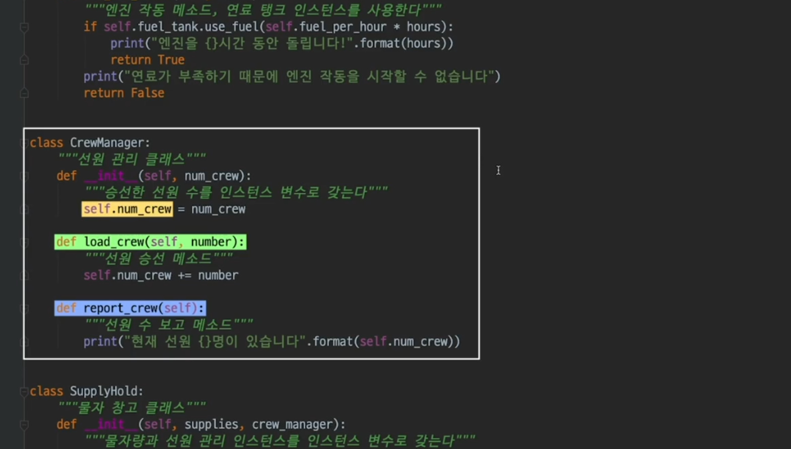
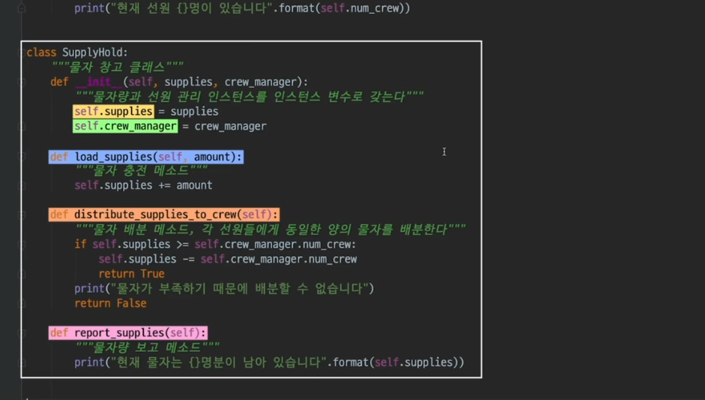
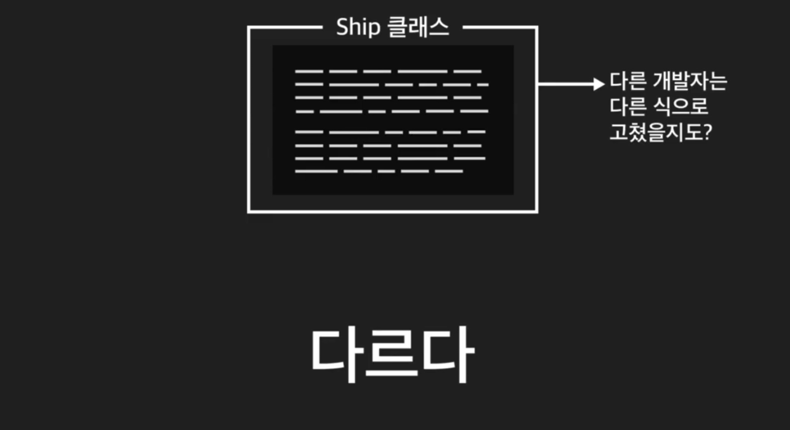
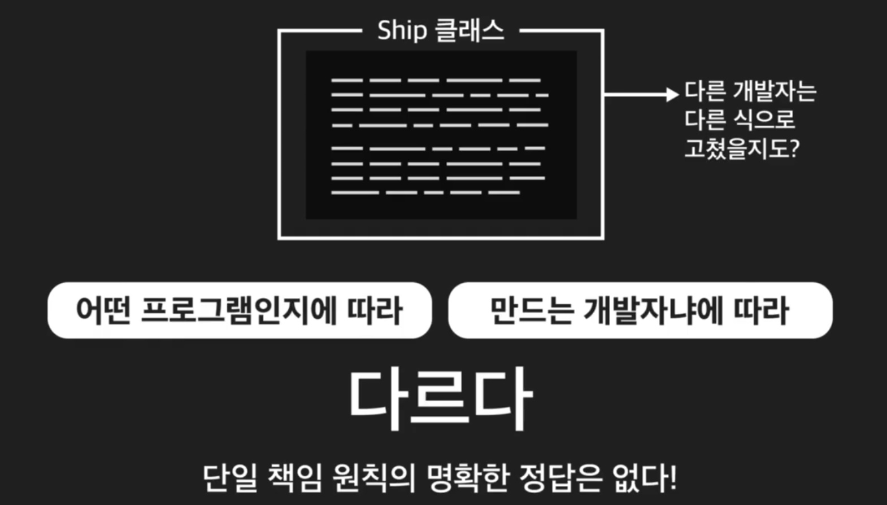

```python
class Ship:
    """배 클래스"""
    def __init__(self, fuel, fuel_per_hour, supplies, num_crew):
        self.fuel_tank = FuelTank(fuel)
        self.crew_manager = CrewManager(num_crew)
        self.supply_hold = SupplyHold(supplies, self.crew_manager)
        self.engine = Engine(self.fuel_tank, fuel_per_hour)


class FuelTank:
    """연료 탱크 클래스"""
    def __init__(self, fuel):
        """연료 탱크에 저장된 연료량을 인스턴스 변수로 갖는다"""
        self.fuel = fuel

    def load_fuel(self, amount):
        """연료 충전 메소드"""
        self.fuel += amount

    def use_fuel(self, amount):
        """연료 사용 메소드"""
        if self.fuel - amount >= 0:
            self.fuel -= amount
            return True
        print("연료가 부족합니다!")
        return False

    def report_fuel(self):
        """연료량 보고 메소드"""
        print("현재 연료는 {}l 남아 있습니다".format(self.fuel))


class Engine:
    """엔진 클래스"""
    def __init__(self, fuel_tank, fuel_per_hour):
        """연료 탱크 인스턴스와 시간당 연료 소비량을 인스턴스 변수로 갖는다"""
        self.fuel_tank = fuel_tank
        self.fuel_per_hour = fuel_per_hour

    def run_for_hours(self, hours):
        """엔진 작동 메소드, 연료 탱크 인스턴스를 사용한다"""
        if self.fuel_tank.use_fuel(self.fuel_per_hour * hours):
            print("엔진을 {}시간 동안 돌립니다!".format(hours))
            return True
        print("연료가 부족하기 때문에 엔진 작동을 시작할 수 없습니다")
        return False


class CrewManager:
    """선원 관리 클래스"""
    def __init__(self, num_crew):
        """승선한 선원 수를 인스턴스 변수로 갖는다"""
        self.num_crew = num_crew

    def load_crew(self, number):
        """선원 승선 메소드"""
        self.num_crew += number

    def report_crew(self):
        """선원 수 보고 메소드"""
        print("현재 선원 {}명이 있습니다".format(self.num_crew))


class SupplyHold:
    """물자 창고 클래스"""
    def __init__(self, supplies, crew_manager):
        """물자량과 선원 관리 인스턴스를 인스턴스 변수로 갖는다"""
        self.supplies = supplies
        self.crew_manager = crew_manager

    def load_supplies(self, amount):
        """물자 충전 메소드"""
        self.supplies += amount

    def distribute_supplies_to_crew(self):
        """물자 배분 메소드, 각 선원들에게 동일한 양의 물자를 배분한다"""
        if self.supplies >= self.crew_manager.num_crew:
            self.supplies -= self.crew_manager.num_crew
            return True
        print("물자가 부족하기 때문에 배분할 수 없습니다")
        return False

    def report_supplies(self):
        """물자량 보고 메소드"""
        print("현재 물자는 {}명분이 남아 있습니다".format(self.supplies))
```
```python
"""원칙 적용전"""

# ship 인스턴스 생성        
ship = Ship(400, 1, 1000, 50)

# ship 인스턴스 추가 연료 보충
ship.load_fuel(10)

# ship 인스턴스 추가 물자 보급
ship.load_supplies(10)

# ship 인스턴스의 추가 선원 승선
ship.load_crew(10)

# ship 인스턴스내 물자 배급
ship.distribute_supplies_to_crew()

# ship 인스턴스 엔진 작동
ship.run_engine_for_hours(4)

# ship 인스턴스 연료량 보고
ship.report_fuel()

# ship 인스턴스 물자량 보고
ship.report_supplies()

# ship 인스턴스 승선 수 보고
ship.report_crew()
```
```python
"""원칙 적용 후""" 
# ship 인스턴스 생성
ship = Ship(400, 10, 1000, 50)

# 연료 탱크 클래스에 추가 연료 충전
ship.fuel_tank.load_fuel(10)

# 물자 창고 클래스에 추가 물자 보급
ship.supply_hold.load_supplies(10)

# 선원 관리 클래스에 추가 선원 승선
ship.crew_manager.load_crew(10)

# 물자 창고 클래스에서 물자 배분 메소드 실행
ship.supply_hold.distribute_supplies_to_crew()

# 엔진 클래스에서 엔진 작동 메소드 실행
ship.engine.run_for_hours(4)

# 연료 탱크 클래스의 연료량 메소드 실행
ship.fuel_tank.report_fuel()

# 물자 창고 클래스의 물자량 메소드 실행
ship.supply_hold.report_supplies()

# 선원 클래스의 선원 수 보고 메소드 실행
ship.crew_manager.report_crew()
```
```python
"""
Print Output:

엔진을 4시간 동안 돌립니다!
현재 연료는 370l 남아 있습니다
현재 물자는 950명분이 남아 있습니다
현재 선원 60명이 있습니다

Variables:
-{
    Ship: -{
        py/type: "__main__.Ship"
    },
    FuelTank: -{
        py/type: "__main__.FuelTank"
    },
    Engine: -{
        py/type: "__main__.Engine"
    },
    CrewManager: -{
        py/type: "__main__.CrewManager"
    },
    SupplyHold: -{
        py/type: "__main__.SupplyHold"
    },
    ship: -{
        py/object: "__main__.Ship",
        fuel_tank: +{2 items},
        crew_manager: +{2 items},
        supply_hold: +{3 items},
        engine: +{3 items}
    }
}
"""
```
+ 단일 책임 원칙을 적용했을 경우 Ship 클래스가 어떠한 동작을 자신이 직접 하지 않는다.

+ 그 대신에 관련된 책임을 담당한 다른 클래스의 인스턴스를 통해 그 동작을 하게 된다.

+ 기존의 Ship 클래스와 비교해 보자면

+ 전체적인 길이는 조금 더 늘어났지만, 

+ 클래스 기준으로 개별적으로 보았을 때는 매우 짧아 졌다

+ 짧은 것이 훨씬 나은 이유는 클래스의 의미 파악도 쉽고

+ 각 클래스를 이해하기 쉬워야 나중에 변동 사항이 생겨도 고치기 쉬워 진다.





