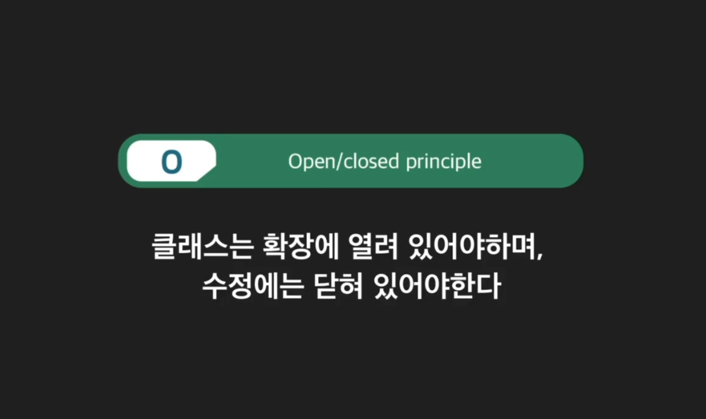

```python
class AppleKeyboard:
    """애플 키보드 클래스"""

    def __init__(self):
        """키보드 인풋과 터치바 인풋"""
        self.keyboard_input = ""

    def set_keyboard_input(self, input):
        """키보드 인풋 저장 메소드"""
        self.keyboard_input = input

    def send_keyboard_input(self):
        """키보드 인풋 전송 메소드"""
        return self.keyboard_input


class KeyboardManager:
    def __init__(self):
        """키보드 관리 클래스"""
        self.keyboard = None

    def connect_to_keyboard(self, keyboard):
        """키보드 교체 메소드"""
        self.keyboard = keyboard

    def get_keyboard_input(self):
        """
        유저가 키보드로 입력한 내용을 받아오는 메소드
        하지만 아래의 내용은 개방/폐쇄의 원칙을 위반하는 것인데
        왜냐하면 원칙에 따르면 기존 기능을 확장하더라도 코드는 수정을 하면 안된다.
        """
        if isinstance(self.keyboard, AppleKeyboard):
            return self.keyboard.send_keyboard_input()
        elif isinstance(self.keyboard, SamsungKeyboard):
            return self.keyboard.give_user_input()
    
class SamsungKeyboard:
    """삼성 키보드 클래스"""
    
    def __init__(self):
        """키보드 인풋"""
        self.user_input = ""
    
    def save_user_input(self, input):
        """키보드 인풋 저장 메소드"""
        self.user_input = input
    
    def give_user_input(self):
        """키보드 인풋 전송 메소드"""
        return self.user_input
        
    

keyboard_manager = KeyboardManager()

apple_keyboard = AppleKeyboard()
keyboard_manager.connect_to_keyboard(apple_keyboard)
apple_keyboard.set_keyboard_input("안녕하세요")
print(keyboard_manager.get_keyboard_input())

samsung_keyboard = SamsungKeyboard()
keyboard_manager.connect_to_keyboard(samsung_keyboard)
samsung_keyboard.save_user_input("안녕하세요")
print(keyboard_manager.get_keyboard_input())

"""
출력결과

안녕하세요
안녕하세요
"""
```


