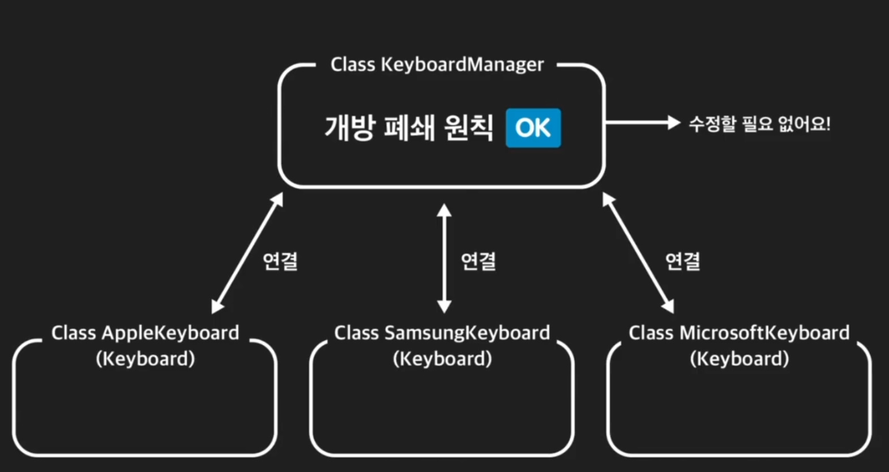
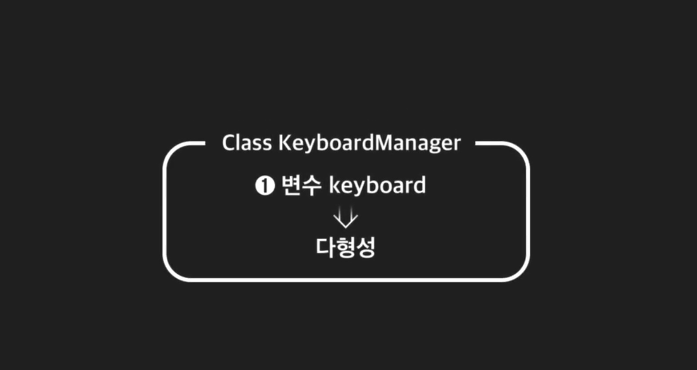
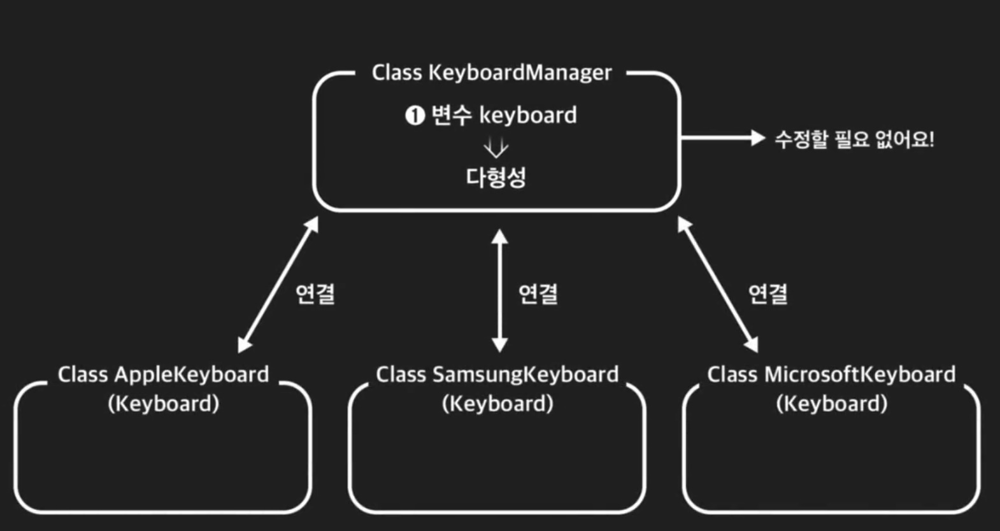
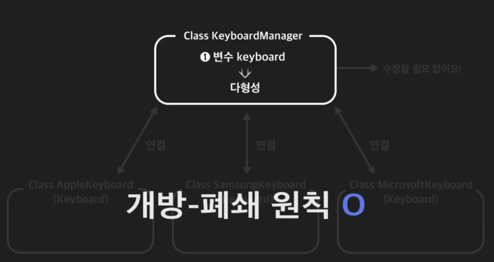
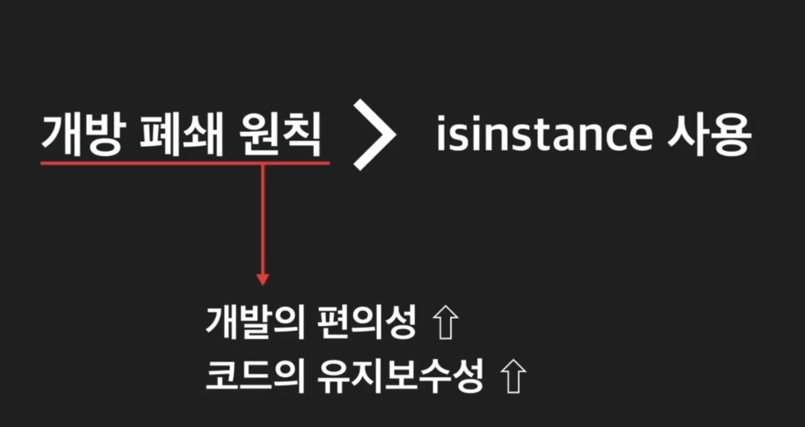
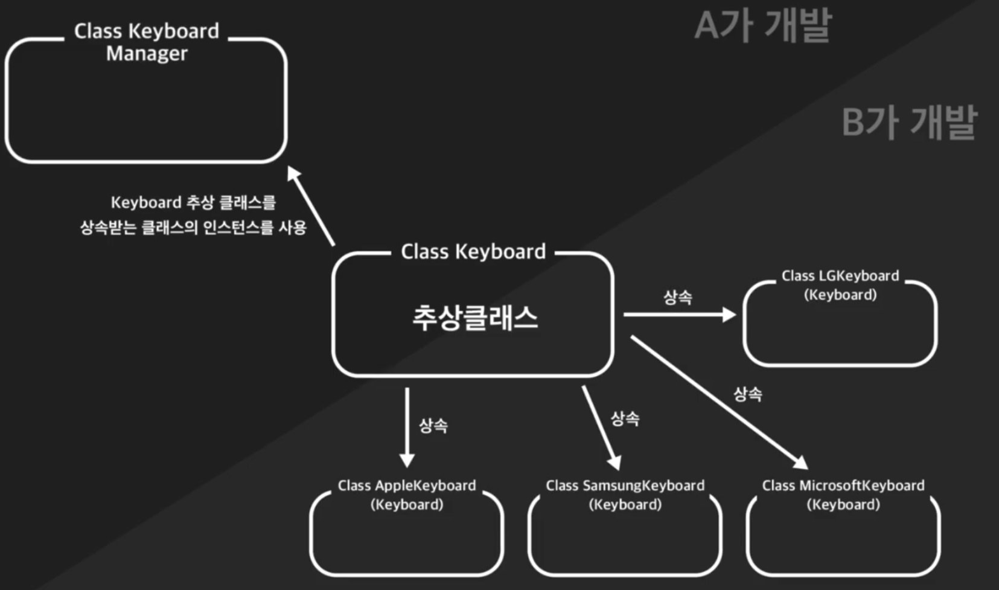
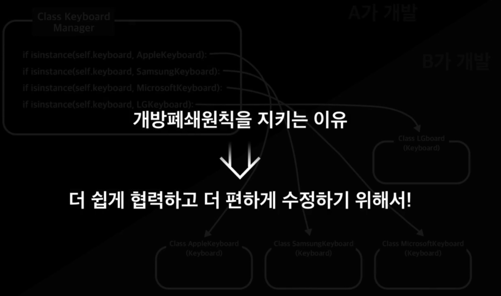

+ 다형성을 사용하면 개방/폐쇄의 원칙을 지킬 수 있다.

+ 우선 모든 클래스의 추상화된 공통점이 되는 추상클래스를 만든다.

```python
from abc import ABC, abstractmethod


class Keyboard(ABC):
    @abstractmethod
    def save_input(self, content: str) -> None:
        """키보드 인풋 저장 메소드"""
        pass
    
    @abstractmethod
    def send_input(self) -> str:
        """키보드 인풋 전송 메소드"""
        pass
```
+ 이렇게 하면 이제 모든 회사의 키보드 클래스는 추상클래스 Keyboard 클래스를 상속받으면 된다.

+ 그리고 save_input과 send_input을 오버라이딩하면된다.

```python
from abc import ABC, abstractmethod


class Keyboard(ABC):
    @abstractmethod
    def save_input(self, content: str) -> None:
        """키보드 인풋 저장 메소드"""
        pass
    
    @abstractmethod
    def send_input(self) -> str:
        """키보드 인풋 전송 메소드"""
        pass
    
    

class AppleKeyboard(Keyboard):
    """애플 키보드 클래스"""

    def __init__(self):
        """키보드 인풋과 터치바 인풋"""
        self.keyboard_input = ""

    def save_input(self, input):
        """키보드 인풋 저장 메소드"""
        self.keyboard_input = input

    def send_input(self):
        """키보드 인풋 전송 메소드"""
        return self.keyboard_input
    
class SamsungKeyboard(Keyboard):
    """삼성 키보드 클래스"""
    
    def __init__(self):
        """키보드 인풋"""
        self.user_input = ""
    
    def save_input(self, input):
        """키보드 인풋 저장 메소드"""
        self.user_input = input
    
    def send_input(self):
        """키보드 인풋 전송 메소드"""
        return self.user_input


class KeyboardManager:
    def __init__(self):
        """키보드 관리 클래스"""
        self.keyboard = None

    def connect_to_keyboard(self, keyboard):
        """키보드 교체 메소드"""
        self.keyboard = keyboard

    def get_keyboard_input(self):
        """유저가 키보드로 입력한 내용을 받아오는 메소드"""
        return self.keyboard.send_input()
    

        
    

keyboard_manager = KeyboardManager()

apple_keyboard = AppleKeyboard()
samsung_keyboard = SamsungKeyboard()

keyboard_manager.connect_to_keyboard(apple_keyboard)
apple_keyboard.save_input("안녕하세요")
print(keyboard_manager.get_keyboard_input())

keyboard_manager.connect_to_keyboard(samsung_keyboard)
samsung_keyboard.save_input("안녕하세요")
print(keyboard_manager.get_keyboard_input())

"""
출력 결과

안녕하세요
안녕하세요
"""
```









