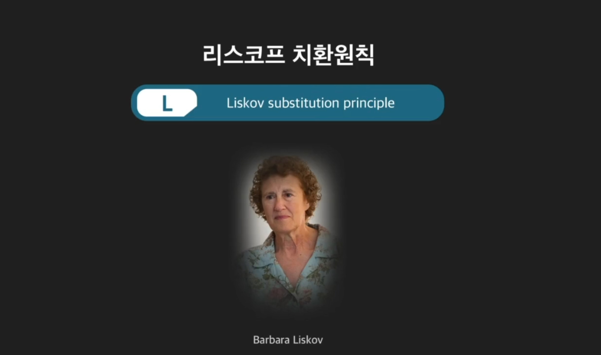
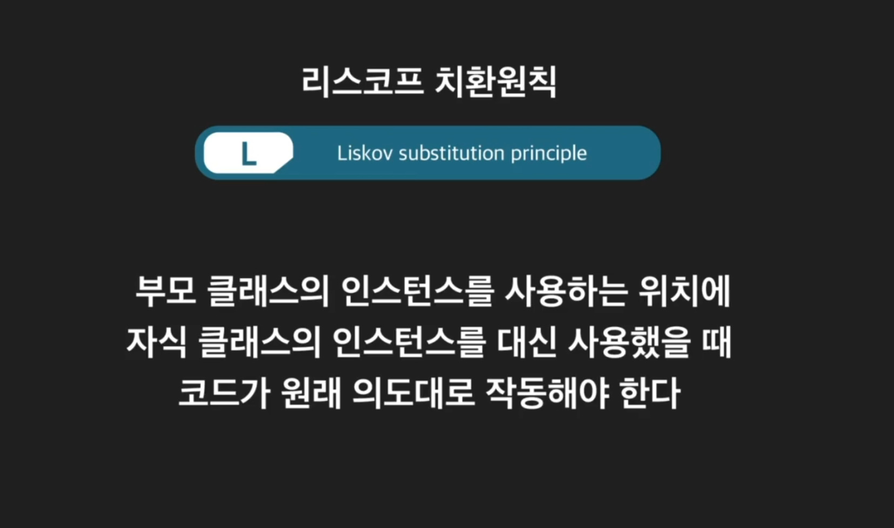
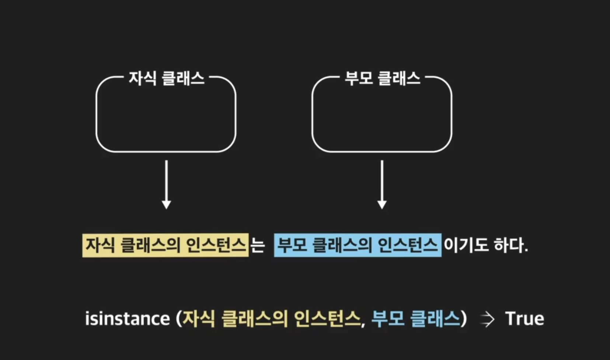
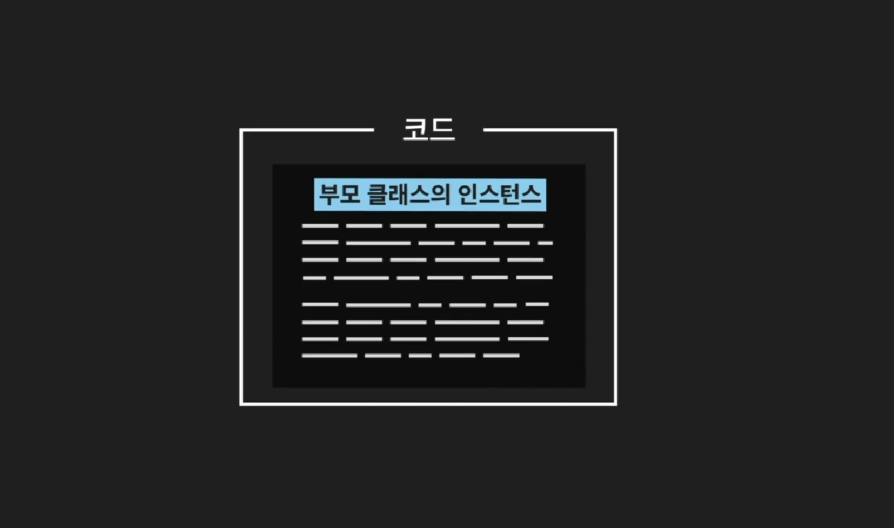
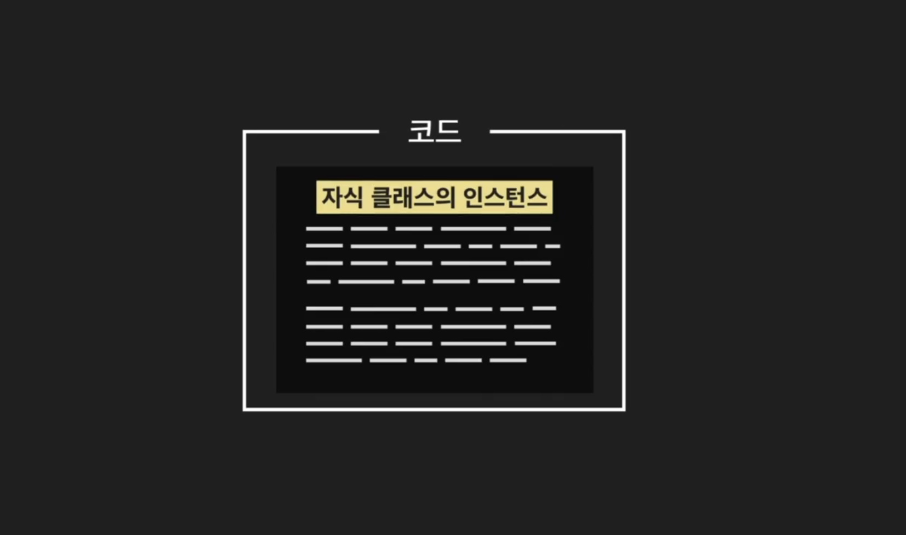

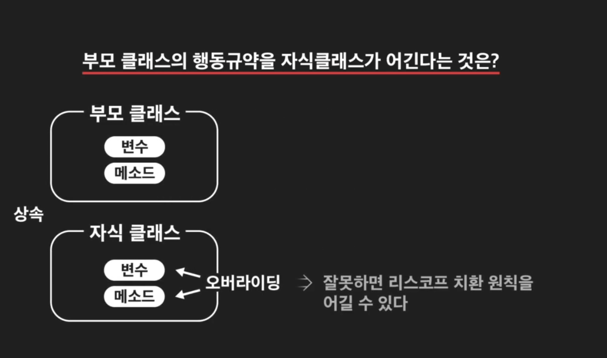
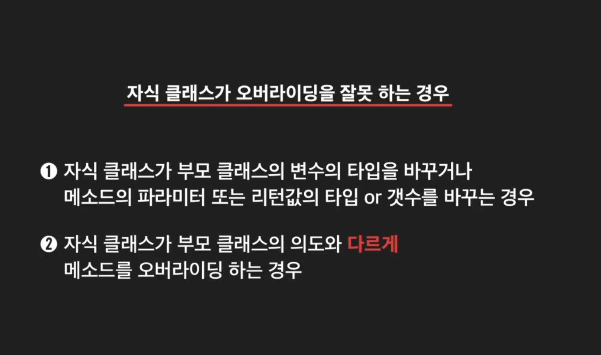
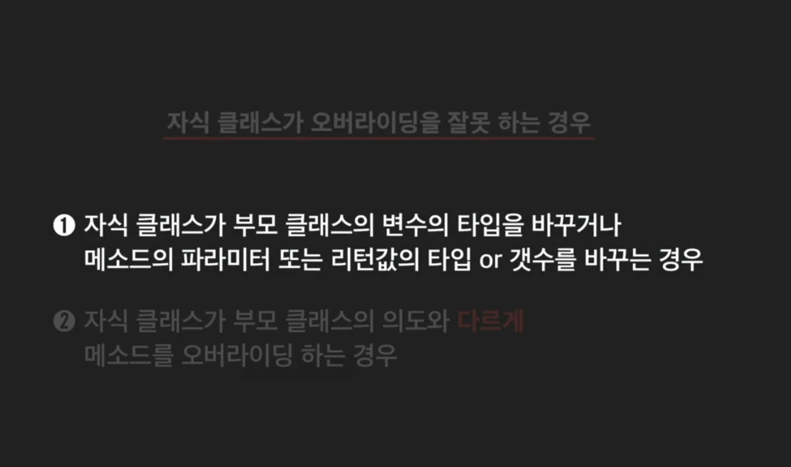

```python
class Employee:
    """직원 클래스"""
    company_name = "코드잇 버거"
    raise_percentage = 1.03

    def __init__(self, name, wage):
        self.name = name
        self._wage = wage

    def raise_pay(self):
        """직원 시급을 인상하는 메소드"""
        self._wage *= self.raise_percentage

    @property
    def wage(self):
        return self._wage

    def __str__(self):
        """직원 정보를 문자열로 리턴하는 메소드"""
        return Employee.company_name + " 직원: " + self.name


class Cashier(Employee):
    """리스코프 치환 원칙을 지키지 않는 계산대 직원 클래스"""
    burger_price = 4000

    def __init__(self, name, wage, number_sold=0):
        super().__init__(name, wage)
        self.number_sold = number_sold

    def raise_pay(self, raise_amount):
        """직원 시급을 인상하는 메소드"""
        self.wage += self.raise_amount

    @property
    def wage(self):
        return "시급 정보를 알려줄 수 없습니다"
    
employee1 = Employee("성태호", 7000)
employee2 = Employee("강영훈", 6500)

cashier = Cashier("김대위", 9000)

employee_list = []
employee_list.append(employee1)
employee_list.append(employee2)
employee_list.append(cashier)
```
```python
for employee in employee_list:
    employee.raise_pay()        
```
+ 문제가 발생한다.

    + Employee 쪽은 문제가 없으나 

    + cashier 쪽의 raise_pay()의 파라미터가 빠져서 에러가 발생한다.

    + TypeError: Cashier.raise_pay() missing 1 required positional argument: 'raise_amount'

    + 이것이 리스코프의 치환원칙 위반이다.

```python
total_wage = 0
for employee in employee_list:
    total_wage += employee.wage
    
print(total_wage)
```
+ 역시 문제가 발생한다.

    + cashier 쪽의 __str__쪽에서 문자열로 리턴하고 있어서 에러가 발생한다.
    + TypeError: unsupported operand type(s) for +=: 'int' and 'str'
    + 역시 리스코프의 치환원칙 위반이다.

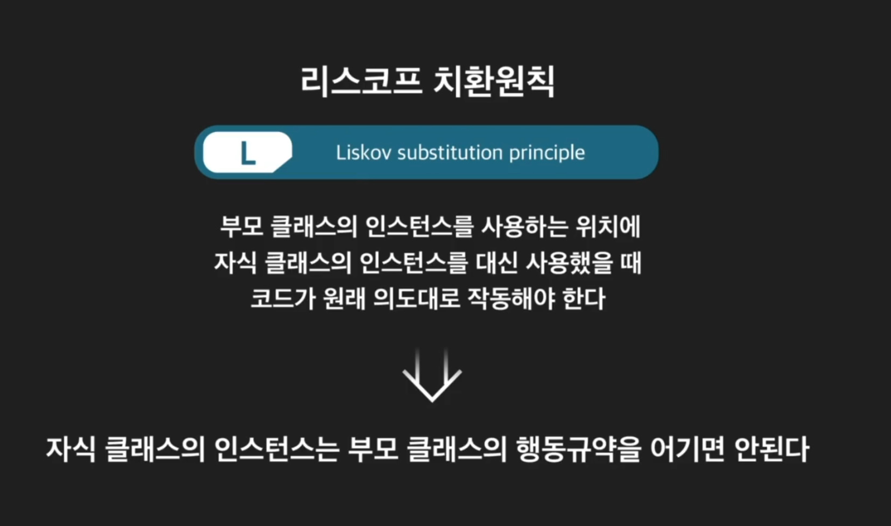
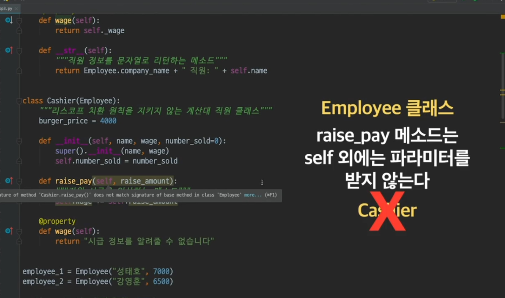
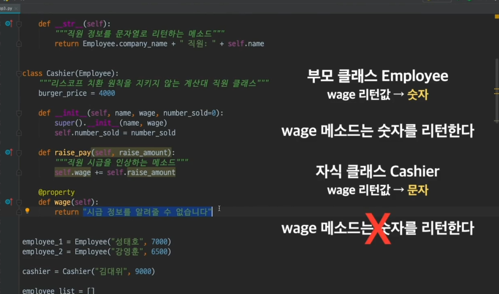