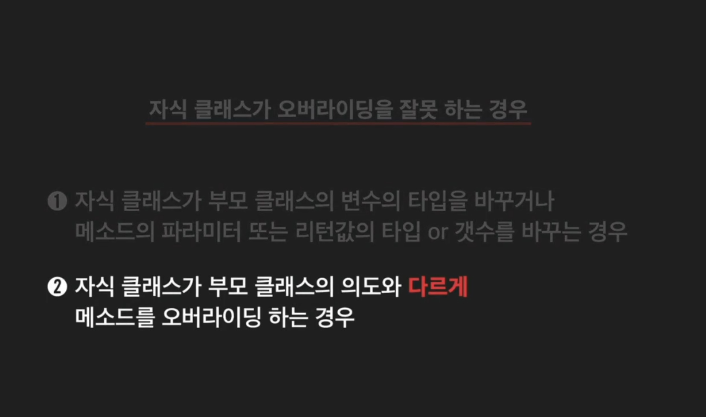
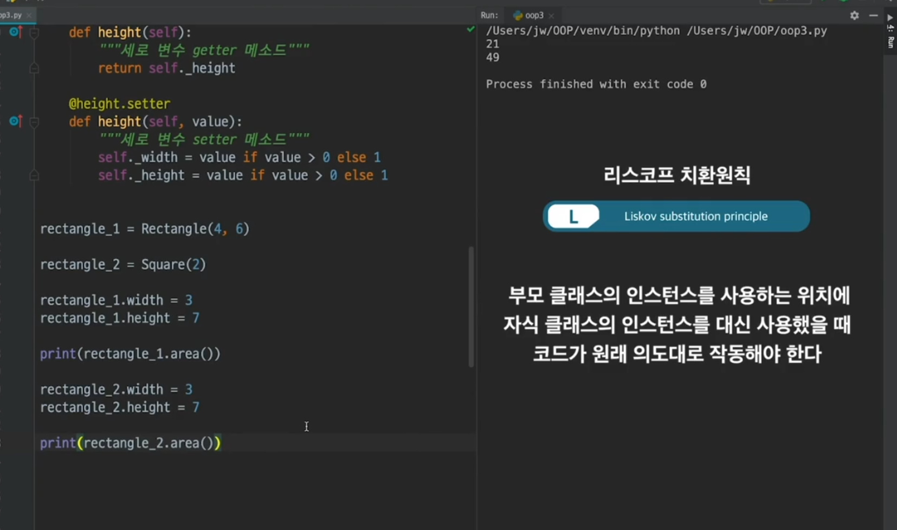
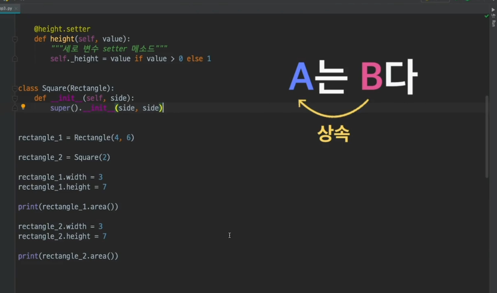
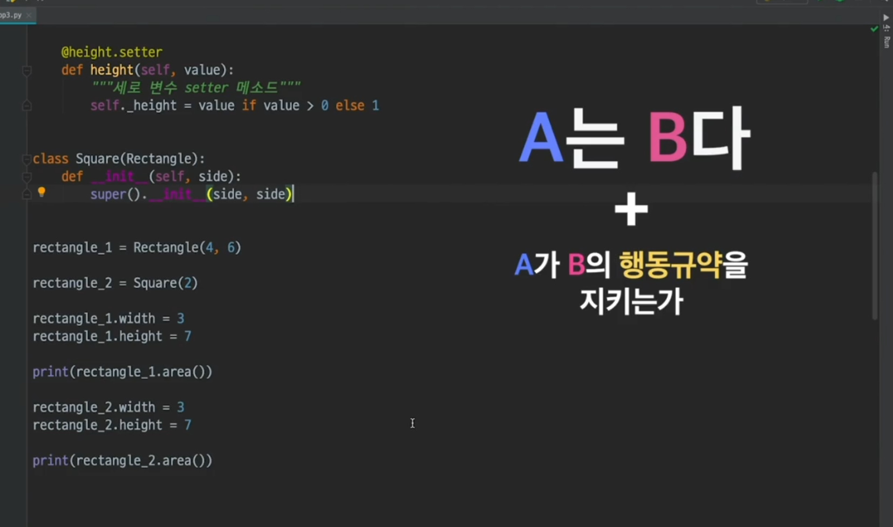

```python
class Rectangle:
    """직사각형 클래스"""

    def __init__(self, width, height):
        """세로와 가로"""
        self.width = width
        self.height = height

    def area(self):
        """넓이 계산 메소드"""
        return self.width * self.height

    @property
    def width(self):
        """가로 변수 getter 메소드"""
        return self._width

    @width.setter
    def width(self, value):
        """가로 변수 setter 메소드"""
        self._width = value if value > 0 else 1

    @property
    def height(self):
        """세로 변수 getter 메소드"""
        return self._height

    @height.setter
    def height(self, value):
        """세로 변수 setter 메소드"""
        self._height = value if value > 0 else 1


class Square:
    def __init__(self, side):
        self.side = side
    
    def area(self):
        """정사각형 넓이 계산 메소드"""
        return self.side * self.side

    @property
    def width(self):
        """가로 변수 getter 메소드"""
        return self._width

    @width.setter
    def width(self, value):
        """가로 변수 setter 메소드"""
        self._width = value if value > 0 else 1
        self._height = value if value > 0 else 1

    @property
    def height(self):
        """세로 변수 getter 메소드"""
        return self._height

    @height.setter
    def height(self, value):
        """세로 변수 setter 메소드"""
        self._width = value if value > 0 else 1
        self._height = value if value > 0 else 1
        
rectangle =  Rectangle(6, 4)
square =  Square(2)

rectangle.width = 3
rectangle.height = 7

print(rectangle.area())   # 21

square.side = 10
print(square.area())   # 100
```



